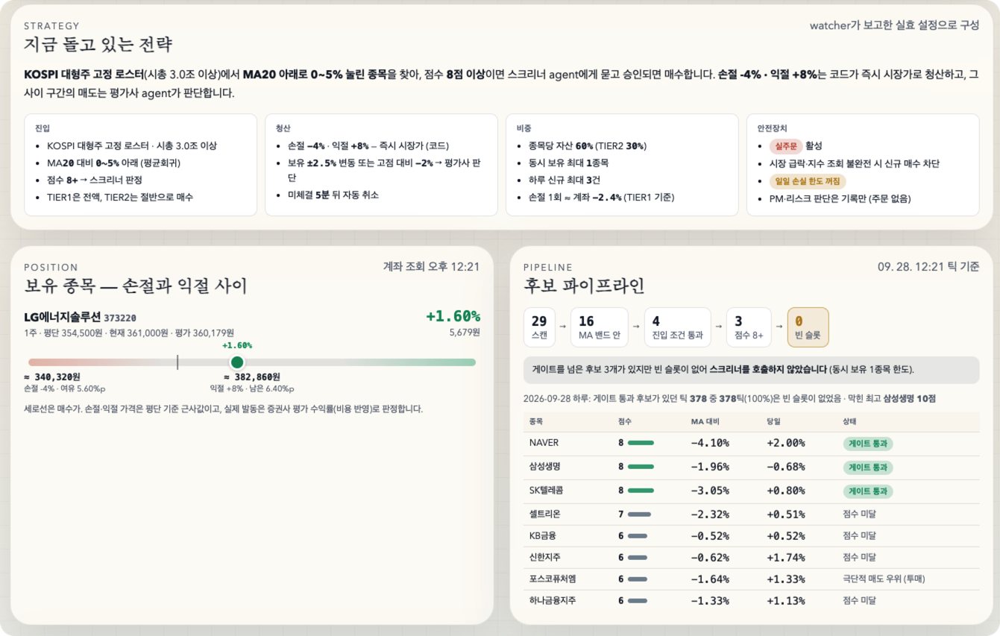
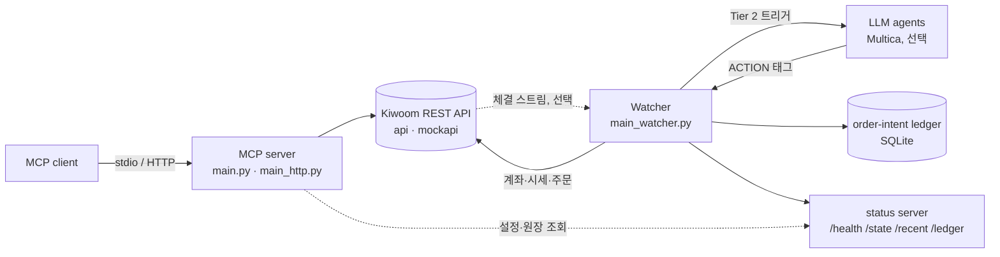

# agent-trader

[키움증권 REST API](https://openapi.kiwoom.com)로 KRX 주식을 매매하는 개인 프로젝트

종목 투자 여부는 LLM agent가 판단하고, 실제 매매 로직은 코드로 구현



- **MCP server**: Claude 같은 MCP client에 키움 계좌·시세 조회 도구를 제공. 잔고, 체결, 미체결, 현재가, 일봉, 시장 스냅샷을 조회
- **Watcher**: 계좌 하나를 장중 내내 지켜보는 루프. 손절, 익절, 오래된 미체결 취소는 코드가 바로 처리. 종목 매매 판단은 [Multica](https://github.com/multica-ai/multica)를 거쳐 LLM agent 콜백
- **Order-intent ledger**: 주문을 보내기 전에 먼저 적어 두고 나중에 브로커 조회와 맞춰 보는 원장
- **검증 도구**: walk-forward, bootstrap CI, PBO, Deflated Sharpe, random-entry control, rank IC (등등) 전략 판단

> [!WARNING]
> 지금 쓰는 진입 규칙은 KOSPI 대형주가 20일 이동평균보다 몇 % 아래로 눌렸을 때 사는 방식이다. 백테스트에서는 비용을 빼고 나면 무작위 진입보다 나을 게 없었고, 실거래 후보 점수도 이후 수익률과 순위 상관이 없었다. 두 검증 모두 저장소에 들어 있다(`backtest.run significance`, `automation/signal_efficacy.py`). 왜 그런지는 [투자 이론 정리 9장](https://docs.cocopam.dev/investment-theory/09-system-theory-audit/)에 따로 정리

## 동작 방식



- 장중에는 30초 간격으로 돌고, 장 마감 후에는 대기
- strategy planner는 데이터 소스(regime, 보유 종목, 후보 점수)로만 쓰고 주문은 전부 watcher가 실행

| Tier | 트리거                                   | 판단                 | 결과                                                      |
| ---- | ------------------------------------- | ------------------ | ------------------------------------------------------- |
| 1    | 손절·익절 기준 도달                           | 코드                 | 바로 시장가 매도                                               |
| 1    | 보유 종목이 `--max-positions`보다 많음         | 코드                 | 수익률이 가장 낮은 종목 매도                                        |
| 1    | 미체결이 `--stale-unfilled-minutes` 넘게 남음 | 코드                 | 취소                                                      |
| 2    | 보유 종목이 크게 움직이거나 장중 고점에서 밀림            | evaluator agent    | `HOLD` · `TRIM` · `TAKE_PROFIT` · `CUT_LOSS` · `ROTATE` |
| 2    | 새 후보가 점수 기준을 넘음                       | screener squad     | `TIER1`(예산 전액) · `TIER2`(절반) · `REJECT`                 |
| 2    | regime 전환, 급락장, 정기 점검                 | PM squad           | 참고만 (주문 없음)                                             |
| 2    | API 실패 반복, 미체결 누적                     | risk manager agent | 참고만 (주문 없음)                                             |

- agent 응답 끝의 ACTION 태그(`<!-- ACTION: HOLD -->`)로 결정을 파싱 (`src/services/multica_dispatch.py`)
- 보유 종목에 주문이 나가는 응답은 역할이 다른 agent가 교차 검토
- 신규 매수는 `TIER1`/`TIER2` 응답으로만 발생. agent 없이 돌리면 보유 종목 관리만 함
- agent 프롬프트·skill은 Multica workspace에 있고 저장소에는 없음. dispatcher가 쓰는 agent 이름은 `multica_dispatch.py` 참고

## 안전장치

주문이 거치는 순서대로 정리

| 장치                 | 하는 일                                                                                                                                    | 위치                               |
| ------------------ | --------------------------------------------------------------------------------------------------------------------------------------- | -------------------------------- |
| 두 단계 live 스위치      | `--execute-orders` 없으면 dry run. live 계좌는 `KIWOOM_LIVE_CONFIRM=YES_I_REALLY_WANT_TO_TRADE`까지 필요. `--disable-new-entries`는 매수만 중지         | `main_watcher.py`                |
| 우회 경로 차단           | live 계좌에서 MCP 주문 도구와 예전 in-process 엔진을 숨기고 호출도 거부. `KIWOOM_ALLOW_DIRECT_LIVE_ORDERS=true`일 때만 허용 (mock은 항상 허용)                          | `src/mcp_server.py`              |
| 주문 전 기록            | 요청 전에 SQLite 원장에 `INTENDED`로 커밋하고 브로커 미체결·체결 조회로 대사. 재시작이나 응답 유실에도 중복 주문 없음                                                             | `src/services/order_ledger.py`   |
| 불확실하면 접수로          | timeout·5xx는 `UNKNOWN`으로 두고 나간 주문으로 취급. 매수는 브로커 증거 없이 재전송 안 함. 보호 매도는 브로커 조회에서 연속으로 안 보일 때만 해제                                          | `order_ledger.py`, `order.py`    |
| 접수 ≠ 체결            | `submitted`와 `filled`를 분리. `filled`는 대사에서만 기록                                                                                           | `src/services/order_result.py`   |
| 노출 한도              | 매수 직전 미체결·체결 재조회 (수동 주문 포함). 최대 보유 종목 수와 대기 주문까지 합친 종목당 예산 적용. 매도 수량은 브로커에 걸린 만큼 차감                                                     | `src/services/watcher.py`        |
| 비대칭 fail-closed    | 원장·계좌 조회·캘린더 오류 시 신규 매수만 차단. 손절·익절·agent 매도·취소는 경보 후 그대로 실행                                                                             | 코드 전반                            |
| 로컬 디스크 원장          | NFS·CIFS·SMB·SSHFS에서는 원장을 열지 않고 신규 매수 차단 (SQLite WAL 안전성)                                                                               | `order_ledger.py`                |
| 일일 circuit breaker | 하루 손실(%·원)과 신규 진입 횟수 상한. 거래일 단위로 유지되고 재시작해도 안 풀림. 손실 상한을 `--acknowledge-daily-loss-source-verified` 없이 걸면 신규 매수 전면 차단 (손익 필드 검증 전까지 불신) | `src/services/daily_risk.py`     |
| 시장 가드              | KRX 휴장일 캘린더 (현재 2026년만 지원, `docs/krx-calendar-maintenance.md`). 미지원 연도는 신규 매수 차단. 지수 급락이나 지수 데이터 불완전 시 진입 veto                          | `krx_calendar.py`, `strategy.py` |
| stale 응답 폐기        | agent 응답 동안 가격이 `--stale-price-delta-pct`(1.5%) 넘게 움직이면 ACTION 폐기. `--agent-timeout-seconds` 안에 응답이 없으면 아무것도 안 함                        | `watcher.py`                     |

- 잔여 위험과 검증 절차는 `order_ledger.py`, `daily_risk.py` 모듈 docstring 참고
- 키움이 client order id를 지원하지 않아 exactly-once는 불가능. 원장은 중복을 보수적으로 막는 수준

## 시작하기

- 필요: Python 3.12+, [uv](https://docs.astral.sh/uv/), 키움 REST API 키 (모의투자 키로 시작 가능)
- 선택: Multica CLI·workspace (agent 판단), Discord webhook (알림)

```bash
git clone https://github.com/ljy2855/agent-trader.git
cd agent-trader
uv sync
```

`.env`

```dotenv
KIWOOM_USE_MOCK=true
KIWOOM_MOCK_APPKEY=your-mock-app-key
KIWOOM_MOCK_SECRETKEY=your-mock-secret-key

# live 계좌 (모의투자로 충분히 돌려 본 뒤)
# KIWOOM_USE_MOCK=false
# KIWOOM_APPKEY=your-live-app-key
# KIWOOM_SECRETKEY=your-live-secret-key
```

`KIWOOM_USE_MOCK=true`면 모든 요청이 `https://mockapi.kiwoom.com`으로 감 (KRX만 지원). 토큰은 자동 발급·갱신, 만료로 실패한 요청은 1회 재시도

### MCP server (stdio)

MCP client 설정

```json
{
  "mcpServers": {
    "kiwoom": {
      "command": "uv",
      "args": ["run", "--directory", "/path/to/agent-trader", "python", "main.py"]
    }
  }
}
```

Claude Code 환경 `claude mcp add kiwoom -- uv run --directory /path/to/agent-trader python main.py`

### MCP server (HTTP)와 dashboard

```bash
KIWOOM_HTTP_HOST=127.0.0.1 uv run python main_http.py
```

- MCP endpoint: `http://127.0.0.1:8000/mcp` (streamable HTTP)
- dashboard: `/` (계좌 요약, 손익, KOSPI 대비 성과, agent 판단 타임라인)
- JSON API: `/api/dashboard`, `/api/agent_overview`, `/api/agent_timeline`
- dashboard만 실행: `uv run python main_dashboard.py` ([http://127.0.0.1:8001](http://127.0.0.1:8001))

> [!CAUTION]
> HTTP server는 인증이 없고, `KIWOOM_HTTP_HOST`를 지정하지 않으면 `0.0.0.0`에 바인딩. `/api/dashboard`가 잔고·보유 종목·체결 내역을 그대로 반환하므로 localhost나 인증 proxy 뒤에서만 사용

### Watcher

```bash
cp automation/trading_env.example.sh automation/trading_env.sh   # 값 채우기
source automation/trading_env.sh

uv run python main_watcher.py                       # dry run (주문 없음)
uv run python main_watcher.py --status-port 8002    # /health /state /recent /ledger
uv run python main_watcher.py --execute-orders      # mock 계좌면 mockapi로 주문
```

- live 계좌에서 `--execute-orders`는 `KIWOOM_LIVE_CONFIRM`까지 필요
- 한 계좌에 watcher 하나만 실행 (lock·cooldown이 메모리에 있어 둘이면 중복 주문 가능)
- 전략·리스크 파라미터는 전부 CLI 플래그 (`--help`). 기본값은 초기 momentum 설정이라 below-MA는 아래처럼 지정

```bash
uv run python main_watcher.py \
  --entry-mode below_ma --ma-period 20 --universe-mode roster \
  --leaders-market-tp 001 --min-market-cap-krw 3000000000000 \
  --new-candidate-min-score 8 --stop-loss-pct -4 --hard-take-profit-pct 8 \
  --max-daily-new-entries 3
```

로스터는 `src/constants/universe.py`의 KOSPI 대형주 목록 (수동 관리, 백테스트와 공용)

## 설정

`.env`는 `src/config.py`의 `KIWOOM_*` 설정만 읽음. 나머지는 프로세스 환경 변수로 전달 (템플릿: `automation/trading_env.example.sh`)

| 변수                                                                           | 읽는 곳                     | 기본값                                | 용도                                      |
| ---------------------------------------------------------------------------- | ------------------------ | ---------------------------------- | --------------------------------------- |
| `KIWOOM_USE_MOCK`                                                            | 전체                       | `false`                            | `true`면 모의투자                            |
| `KIWOOM_APPKEY`, `KIWOOM_SECRETKEY`                                          | 전체                       | –                                  | live 키                                  |
| `KIWOOM_MOCK_APPKEY`, `KIWOOM_MOCK_SECRETKEY`                                | 전체                       | –                                  | 모의투자 키                                  |
| `KIWOOM_ALLOW_DIRECT_LIVE_ORDERS`                                            | MCP server               | `false`                            | live 주문 도구 허용                           |
| `KIWOOM_HTTP_HOST`, `KIWOOM_HTTP_PORT`                                       | `main_http.py`           | `0.0.0.0`, `8000`                  | HTTP 바인딩                                |
| `KIWOOM_BACKGROUND_AUTO_START`, `…_EXECUTE_ORDERS`, `…_CONFIRM_LIVE_TRADING` | `main_http.py`           | `false`                            | 예전 in-process 엔진 (watcher 사용 시 off)     |
| `KIWOOM_LIVE_CONFIRM`                                                        | watcher                  | –                                  | live 주문 확인 키                            |
| `KIWOOM_WATCHER_STATUS_PORT`, `KIWOOM_WATCHER_STATUS_HOST`                   | watcher                  | `0`(off), `0.0.0.0`                | status server                           |
| `MULTICA_PROJECT`                                                            | watcher, dashboard, 스크립트 | –                                  | agent dispatch용 Multica project         |
| `MULTICA_BIN`                                                                | watcher, dashboard, 스크립트 | 모듈마다 다름                            | `multica` CLI 경로                        |
| `DISCORD_WEBHOOK_URL`                                                        | watcher, 스크립트            | –                                  | 알림                                      |
| `WATCHER_STATE_URL`                                                          | MCP server, 스크립트         | `http://kiwoom-watcher:8001/state` | MCP 전략 도구의 기본값 출처                       |
| `KIWOOM_WATCHER_STATUS_URL`                                                  | MCP server               | –                                  | `get_order_ledger`·agent 화면용 watcher 주소 |

URL 기본값은 Kubernetes service 이름 기준

## MCP 도구

| 분류      | 도구                                                                                                                                                                                                   | 노출 조건                                                  |
| ------- | ---------------------------------------------------------------------------------------------------------------------------------------------------------------------------------------------------- | ------------------------------------------------------ |
| 계좌      | `get_account_evaluation`(kt00004), `get_account_current_status`(kt00017), `get_daily_account_profit_detail`(kt00016), `get_daily_realized_profit_by_stock`(ka10072), `get_orderable_amount`(kt00010) | 항상                                                     |
| 주문 상태   | `get_unexecuted_orders`(ka10075), `get_execution_info`(ka10076), `get_order_execution_status`(kt00009)                                                                                               | 항상                                                     |
| 시세      | `get_market_snapshot`(지수·업종·순위·관심종목), `get_stock_quote`(ka10007), `get_stock_daily_bars`(ka10005, MA20 이격·거래량 배수 포함)                                                                                 | 항상                                                     |
| 전략      | `plan_intraday_momentum_strategy` (주문 없는 계획, 인자 생략 시 watcher 설정 사용)                                                                                                                                  | 항상                                                     |
| watcher | `get_order_ledger` (watcher 원장 읽기 전용)                                                                                                                                                                | 항상                                                     |
| mock 전략 | `run_mock_intraday_momentum_strategy`                                                                                                                                                                | mock에서만                                                |
| 주문      | `place_stock_buy_order`(kt10000), `place_stock_sell_order`(kt10001), `modify_stock_order`(kt10002), `cancel_stock_order`(kt10003)                                                                    | mock, 또는 live에서 `KIWOOM_ALLOW_DIRECT_LIVE_ORDERS=true` |
| 예전 엔진   | `get_background_trade_engine_status`, `update_background_trade_engine_config`, `start_…`, `pause_…`, `resume_…`, `stop_background_trade_engine`                                                      | 주문과 같음                                                 |

주문 도구는 호출마다 `confirm_live_order=true` 필요

## 백테스트와 검증

로스터 종목 일봉 기반 simulator. `backtest/cache/`는 커밋하지 않으므로 `fetch`로 먼저 채움 (API 키 필요)

```bash
uv run python -m backtest.run fetch                   # backtest/cache/ 채우기
uv run python -m backtest.run run                     # below-MA, -4% / +8% (기본값)
uv run python -m backtest.run walkforward --train-days 252 --test-days 90
uv run python -m backtest.run significance --blocks 10 --n-trials 40
uv run python -m backtest.run ic                      # 입력별 정보량부터 확인
```

`significance` 4단계. 파라미터를 바꿔 실거래에 넣으려면 전부 통과해야 함

1. **Bootstrap CI**: 거래당 순수익이 0과 구분되는가
2. **PBO (CSCV)**: in-sample 최적 설정이 out-of-sample에서도 버티는가
3. **Deflated Sharpe**: 시도한 설정 수(`--n-trials`)를 감안해도 남는가
4. **Random-entry control**: 같은 청산 규칙에서 무작위 진입보다 나은가 (알파인지 시장 상승인지 구분)

- `ic`: 입력별 세션 rank IC, 구간 안정성, 비용 차감 top-N 바스켓 확인 (`significance` 이전 단계)
- 수수료·매도세·슬리피지는 인자로 넣는 가정값
- 일봉 기반이라 장중 호가, agent 판단, 포트폴리오 한도는 재현 불가. 로스터에 생존 편향도 있어 결과는 걸러내는 용도로만 사용

## 투자 이론

만들면서 공부한 내용을 [docs.cocopam.dev/investment-theory](https://docs.cocopam.dev/investment-theory/)에 정리. 0~8장은 수익률·복리, 가치평가, 주문·체결, 전략과 엣지, 포지션 사이징, 백테스트·과최적화 같은 기본기, 9장은 지금 돌아가는 시스템을 이론에 대 본 점검

## 구조

```
main.py               MCP server (stdio)
main_http.py          MCP server (streamable HTTP) + dashboard
main_dashboard.py     dashboard만
main_watcher.py       매매 루프. 주문을 내는 유일한 entry point
src/
  config.py           설정 (.env)
  mcp_server.py       MCP 도구와 dashboard route
  dashboard.py, dashboard_template.py, agent_overview.py
  constants/          API ID, 대형주 로스터, 키움 스펙에서 뽑은 요청 필드
  services/
    kiwoom_client.py, token_manager.py      HTTP client, OAuth 토큰 캐시
    account.py, market.py, order.py         키움 API 래퍼
    strategy.py, entry_rules.py             regime, 후보 채점, 진입 필터
    watcher.py, watcher_triggers.py         루프, 트리거 감지 (순수 함수)
    multica_dispatch.py                     Multica CLI로 agent 호출
    order_ledger.py, order_result.py        원장, 대사, 주문 결과 상태
    daily_risk.py, krx_calendar.py          circuit breaker, 거래일 캘린더
    realtime_stream.py, realtime_orders.py  WebSocket 체결 이벤트
    benchmark.py, candidate_journal.py      계좌 대 지수 비교, 후보 점수 기록
automation/           운영 스크립트: Discord 브리핑과 점검, health check, 체결 기록, 신호 검증
backtest/             오프라인 simulator와 검증 통계
tests/                pytest. 네트워크 없이 돈다
docs/                 투자 이론 학습 노트, KRX 캘린더 관리 절차
kiwoom_api_spec.md    키움 REST API 문서를 손으로 옮겨 적은 메모
```

## 개발

```bash
uv run pytest -q
```

- stub client 기반이라 네트워크 없이 실행. 대신 브로커가 거절하는 요청은 못 잡으므로 요청 본문을 바꾸면 모의투자로 확인
- `docker build --platform linux/amd64 -t agent-trader .` 이미지 하나로 모든 entry point 실행 (기본 `main_http.py`, watcher·automation은 container command로 지정)
- 의존성은 `uv.lock` 기준. linux/amd64용 Multica CLI를 포함하므로 amd64로 빌드
- watcher는 replica 1개로 `Recreate` 배포, `output/`(원장, breaker 상태)은 로컬 볼륨에

### 키움 API 메모

- `kiwoom_api_spec.md`: 문서를 손으로 옮긴 메모라 누락이 있음. 예를 들어 ka10075는 `all_stk_tp` 없이 보내면 실패. 최종 기준은 브로커 응답
- `src/constants/vendor/kiwoom_request_fields.json`: 키움 공식 API 저장소에서 추출한 필수 요청 필드. `tests/test_request_field_conformance.py`가 모든 요청 본문과 대조. "선택" 표기는 믿지 않음 (kt10001 `ord_uv`는 선택으로 표기돼 있지만 지정가 주문에서 빼면 거절)
