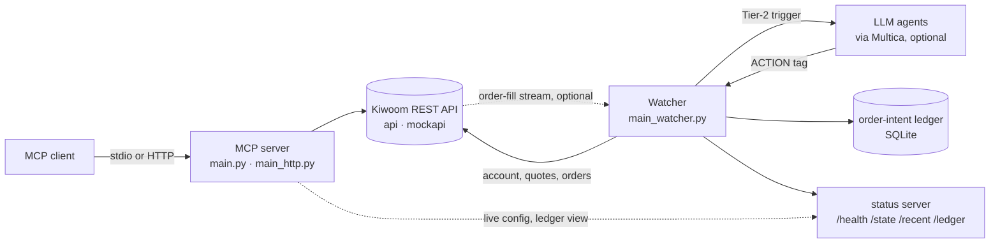

# kiwoom-mcp

An MCP server and an autonomous intraday trading loop for the
[Kiwoom Securities REST API](https://openapi.kiwoom.com) (키움증권 REST API, KRX).

- **MCP server**: lets an LLM client (Claude or any other MCP client) read a
  Kiwoom account and the KRX market, including balances, fills, open orders,
  quotes, daily bars and a market snapshot. The order tools exist, but on a
  live account they stay hidden unless you enable them explicitly.
- **Watcher**: a long-running loop that trades one account. Protective rules
  (stop-loss, take-profit, stale-order cancel) run in code. Judgment calls,
  such as whether to buy a candidate or trim a holding, go to LLM agents
  through [Multica](https://github.com/multica-ai/multica). An agent's answer
  is applied only after staleness and exposure checks.
- **Order-integrity layer**: a persistent order-intent ledger that is
  reconciled against the broker. A crash or a lost response cannot turn into a
  duplicate order.
- **Validation toolkit**: walk-forward testing, bootstrap confidence
  intervals, PBO, Deflated Sharpe, a random-entry control and rank IC. A
  strategy has to beat chance before it is trusted.

> [!WARNING]
> **The engineering is worth reading. The strategy is not.** The deployed
> entry rule buys KOSPI large caps sitting a few percent under their 20-day
> average. In backtests it does not beat a random-entry control after costs,
> and the live candidate score shows no rank correlation with forward
> returns. Both checks ship with the repo (`backtest.run significance`,
> `automation/signal_efficacy.py`). This is a personal project. It is not
> investment advice and is not affiliated with Kiwoom Securities. Start with
> the mock environment.

## How it works



The watcher polls every 30 seconds during KRX hours and sleeps otherwise. It
reuses the strategy planner as a data source only (market regime, holdings,
scored candidates) and routes every order itself:

| Tier | Trigger | Decided by | Outcome |
|---|---|---|---|
| 1 | Stop-loss or hard take-profit reached | code | Market sell, immediately |
| 1 | More holdings than `--max-positions` | code | Sell the weakest holding |
| 1 | Order unfilled for `--stale-unfilled-minutes` | code | Cancel |
| 2 | Holding swings, or drops off its intraday high | evaluator agent | `HOLD` · `TRIM` · `TAKE_PROFIT` · `CUT_LOSS` · `ROTATE` |
| 2 | New candidate clears the score gate | screener squad | `TIER1` (full budget) · `TIER2` (half) · `REJECT` |
| 2 | Regime flip, extreme risk-off, periodic review | PM squad | Advisory only |
| 2 | Repeated API failures, unfilled orders piling up | risk-manager agent | Advisory only |

Agents answer in a Multica issue and end their reply with an `ACTION` tag
(`<!-- ACTION: HOLD -->`). The tag is parsed deterministically
(`src/services/multica_dispatch.py`). An order-placing answer on a holding is
cross-reviewed by an agent in a different role before it runs. New positions
come only from a `TIER1`/`TIER2` answer, so without agents the watcher keeps
protecting existing positions but never opens new ones. The agents' prompts
and skills live in a Multica workspace, not in this repository. The dispatcher
assigns work by agent name, and the names are listed in `multica_dispatch.py`.

## Safety model

Most of the code handles real-money orders. These are the checks an order
meets, roughly in the order it meets them:

| Guard | What it does | Where |
|---|---|---|
| Two-key live switch | Without `--execute-orders` the watcher only logs what it would do. On a live account the flag is refused unless `KIWOOM_LIVE_CONFIRM=YES_I_REALLY_WANT_TO_TRADE` is also set. `--disable-new-entries` stops buying but keeps protective sells and cancels. | `main_watcher.py` |
| No side door | On a live account, the MCP order tools and the legacy in-process engine are hidden and refused unless `KIWOOM_ALLOW_DIRECT_LIVE_ORDERS=true`, because they bypass every guard below. Mock accounts keep them. | `src/mcp_server.py` |
| Intent before request | Every order is committed to a SQLite ledger as `INTENDED` before it is sent, then reconciled against the broker's open-order and execution views. A crash or a lost response cannot become a second order. | `src/services/order_ledger.py` |
| Unknown ≠ rejected | A timeout or 5xx means the order *may* have been accepted, so it is `UNKNOWN` and counted as exposure. A buy is never resubmitted without broker evidence. A protective sell is released only after repeated, fully paginated broker views all lack it. | `order_ledger.py`, `order.py` |
| Submitted ≠ filled | Broker acceptance is recorded as `submitted`. Only reconciliation records `filled`. | `src/services/order_result.py` |
| Exposure gates | Before each buy the watcher checks fresh open orders and executions, including orders placed by hand. It enforces max positions and a per-stock budget that counts pending orders. Sell size is capped by what is not already working at the broker. | `src/services/watcher.py` |
| Asymmetric fail-closed | A ledger, account or calendar failure blocks new buys. Stop-loss, take-profit, agent sells and cancels still go out, with an alert, because a blocked exit is the worse failure. | throughout |
| Ledger on local disk | The ledger refuses to open on NFS, CIFS, SMB or SSHFS, where SQLite WAL is unsafe. New buys stay blocked until it sits on a local filesystem. | `order_ledger.py` |
| Daily breaker | Optional caps on daily loss (percent or KRW) and on new entries per day. The breaker latches for the KRX trading day and survives restarts. A loss cap without `--acknowledge-daily-loss-source-verified` blocks all new buys, on purpose, until you have verified the broker's P&L field for your account. | `src/services/daily_risk.py` |
| Market guards | A KRX holiday calendar with explicitly supported years (only 2026 so far, see `docs/krx-calendar-maintenance.md`): an unsupported year blocks new buys. A crash veto on index breadth and change also fires when index data is incomplete. | `krx_calendar.py`, `strategy.py` |
| Stale answers | An agent `ACTION` is dropped if the price moved more than `--stale-price-delta-pct` (1.5%) while the agent was working. No answer within `--agent-timeout-seconds` means no action. | `watcher.py` |

The module docstrings of `order_ledger.py` and `daily_risk.py` cover the
residual risks and the verification procedure. Kiwoom has no client order
IDs, so the ledger deduplicates conservatively and cannot guarantee
exactly-once delivery.

## Getting started

You need Python 3.12+, [uv](https://docs.astral.sh/uv/), and a Kiwoom REST
API key pair. A mock-trading (모의투자) pair is enough to start. Agent
dispatch also needs the Multica CLI and a workspace, and alerts need a
Discord webhook. Both are optional.

```bash
git clone https://github.com/ljy2855/kiwoom-mcp.git
cd kiwoom-mcp
uv sync
```

Put the credentials in `.env`:

```dotenv
KIWOOM_USE_MOCK=true
KIWOOM_MOCK_APPKEY=your-mock-app-key
KIWOOM_MOCK_SECRETKEY=your-mock-secret-key

# Live account, only after running in mock mode:
# KIWOOM_USE_MOCK=false
# KIWOOM_APPKEY=your-live-app-key
# KIWOOM_SECRETKEY=your-live-secret-key
```

With `KIWOOM_USE_MOCK=true`, every call goes to `https://mockapi.kiwoom.com`,
which covers KRX only. Tokens are issued and refreshed automatically, and a
request that fails on an expired token is retried once.

### MCP server over stdio

Add it to your MCP client's configuration:

```json
{
  "mcpServers": {
    "kiwoom": {
      "command": "uv",
      "args": ["run", "--directory", "/path/to/kiwoom-mcp", "python", "main.py"]
    }
  }
}
```

With Claude Code, run
`claude mcp add kiwoom -- uv run --directory /path/to/kiwoom-mcp python main.py`.

### MCP over HTTP, with the dashboard

```bash
KIWOOM_HTTP_HOST=127.0.0.1 uv run python main_http.py
```

The MCP endpoint is `http://127.0.0.1:8000/mcp` (streamable HTTP). The same
process serves the dashboard at `/` and JSON at `/api/dashboard`,
`/api/agent_overview` and `/api/agent_timeline`. The dashboard shows account
summary, P&L, the account measured against KOSPI, and the agents' decision
timeline. To run the dashboard alone, use `uv run python main_dashboard.py`
(http://127.0.0.1:8001).

> [!CAUTION]
> The HTTP server has no authentication and binds `0.0.0.0` unless
> `KIWOOM_HTTP_HOST` says otherwise. `/api/dashboard` returns balances,
> holdings and fills. Keep it on localhost or behind an authenticating proxy.

### Watcher

```bash
cp automation/trading_env.example.sh automation/trading_env.sh   # then edit it
source automation/trading_env.sh

uv run python main_watcher.py                       # dry run: full loop, no orders
uv run python main_watcher.py --status-port 8002    # also serve /health /state /recent /ledger
uv run python main_watcher.py --execute-orders      # mock account: orders go to mockapi
```

On a live account, `--execute-orders` also requires `KIWOOM_LIVE_CONFIRM`.
Run the watcher as a single instance. Its locks and cooldowns live in memory,
so two watchers on one account can place duplicate orders.

Every strategy and risk parameter is a flag (`--help` lists them). The
defaults describe the original momentum setup. The below-MA setup that the
warning above refers to is selected with flags:

```bash
uv run python main_watcher.py \
  --entry-mode below_ma --ma-period 20 --universe-mode roster \
  --leaders-market-tp 001 --min-market-cap-krw 3000000000000 \
  --new-candidate-min-score 8 --stop-loss-pct -4 --hard-take-profit-pct 8 \
  --max-daily-new-entries 3
```

The roster is a hand-maintained list of KOSPI large caps in
`src/constants/universe.py`, which the backtests use as well.

## Configuration

Only the `KIWOOM_*` credential and mode settings in `src/config.py` are read
from `.env`. Everything else is read from the process environment.
`automation/trading_env.example.sh` is a template for that.

| Variable | Read by | Default | Purpose |
|---|---|---|---|
| `KIWOOM_USE_MOCK` | all | `false` | `true` routes every call to the mock environment |
| `KIWOOM_APPKEY`, `KIWOOM_SECRETKEY` | all | – | Live credentials |
| `KIWOOM_MOCK_APPKEY`, `KIWOOM_MOCK_SECRETKEY` | all | – | Mock credentials |
| `KIWOOM_ALLOW_DIRECT_LIVE_ORDERS` | MCP server | `false` | Lists and allows the live order tools |
| `KIWOOM_HTTP_HOST`, `KIWOOM_HTTP_PORT` | `main_http.py` | `0.0.0.0`, `8000` | HTTP bind address |
| `KIWOOM_BACKGROUND_AUTO_START`, `…_EXECUTE_ORDERS`, `…_CONFIRM_LIVE_TRADING` | `main_http.py` | `false` | Legacy in-process engine. Leave it off when the watcher trades |
| `KIWOOM_LIVE_CONFIRM` | watcher | – | Second key for live orders |
| `KIWOOM_WATCHER_STATUS_PORT`, `KIWOOM_WATCHER_STATUS_HOST` | watcher | `0` (off), `0.0.0.0` | Status server |
| `MULTICA_PROJECT` | watcher, dashboard, scripts | – | Multica project for dispatch issues |
| `MULTICA_BIN` | watcher, dashboard, scripts | varies | Path to the `multica` CLI |
| `DISCORD_WEBHOOK_URL` | watcher, scripts | – | Alerts |
| `WATCHER_STATE_URL` | MCP server, scripts | `http://kiwoom-watcher:8001/state` | Watcher config that the MCP strategy tool uses for its defaults |
| `KIWOOM_WATCHER_STATUS_URL` | MCP server | – | Watcher base URL for `get_order_ledger` and the agent views |

The URL defaults are Kubernetes service names. Override them anywhere else.

## MCP tools

| Group | Tools | Listed |
|---|---|---|
| Account | `get_account_evaluation` (kt00004), `get_account_current_status` (kt00017), `get_daily_account_profit_detail` (kt00016), `get_daily_realized_profit_by_stock` (ka10072), `get_orderable_amount` (kt00010) | always |
| Order status | `get_unexecuted_orders` (ka10075), `get_execution_info` (ka10076), `get_order_execution_status` (kt00009) | always |
| Market | `get_market_snapshot` (indices, sectors, leaderboards, watchlist), `get_stock_quote` (ka10007), `get_stock_daily_bars` (ka10005, with MA20 gap and volume ratio) | always |
| Strategy | `plan_intraday_momentum_strategy`, a dry-run planner whose unset arguments default to the running watcher's config | always |
| Watcher | `get_order_ledger`, a read-only view of the watcher's intent ledger | always |
| Mock strategy | `run_mock_intraday_momentum_strategy` | mock only |
| Orders | `place_stock_buy_order` (kt10000), `place_stock_sell_order` (kt10001), `modify_stock_order` (kt10002), `cancel_stock_order` (kt10003) | mock, or live with `KIWOOM_ALLOW_DIRECT_LIVE_ORDERS=true` |
| Legacy engine | `get_background_trade_engine_status`, `update_background_trade_engine_config`, `start_…`, `pause_…`, `resume_…`, `stop_background_trade_engine` | mock, or live with `KIWOOM_ALLOW_DIRECT_LIVE_ORDERS=true` |

The order tools also require `confirm_live_order=true` on every call.

## Backtesting and validation

The simulator in `backtest/` works on daily bars for the roster. The cache in
`backtest/cache/` is not committed, so fill it with your own API key first:

```bash
uv run python -m backtest.run fetch                   # fill backtest/cache/
uv run python -m backtest.run run                     # below-MA, -4% / +8% (defaults)
uv run python -m backtest.run walkforward --train-days 252 --test-days 90
uv run python -m backtest.run significance --blocks 10 --n-trials 40
uv run python -m backtest.run ic                      # which inputs carry information at all
```

`significance` applies four gates, and a parameter change should pass all of
them before it trades:

1. **Bootstrap CI**: is the net per-trade edge distinguishable from zero?
2. **PBO (CSCV)**: does picking the best configuration in-sample survive out
   of sample?
3. **Deflated Sharpe**: does the result survive the number of configurations
   actually tried? Pass `--n-trials` honestly.
4. **Random-entry control**: with the same exits and random entries, is the
   result alpha or just market drift?

`ic` runs before any of that. It measures the per-session rank correlation of
each candidate input with forward returns, stability across time, and top-N
baskets after costs. Fees, sell tax and slippage are assumptions you pass in.
Daily bars cannot reproduce intraday quotes, agent decisions or portfolio
limits. The roster also carries survivorship bias, so treat backtest numbers
as a filter, not an estimate.

## Project layout

```
main.py               MCP server over stdio
main_http.py          MCP over streamable HTTP, plus the dashboard
main_dashboard.py     dashboard only
main_watcher.py       the trading loop, the only entry point that places orders
src/
  config.py           settings (.env)
  mcp_server.py       MCP tools and dashboard routes
  dashboard.py, dashboard_template.py, agent_overview.py
  constants/          API ids, large-cap roster, vendor request-field data
  services/
    kiwoom_client.py, token_manager.py      HTTP client, OAuth token cache
    account.py, market.py, order.py         Kiwoom API wrappers
    strategy.py, entry_rules.py             regime, candidate scoring, entry filters
    watcher.py, watcher_triggers.py         the loop, pure trigger detection
    multica_dispatch.py                     agent dispatch over the Multica CLI
    order_ledger.py, order_result.py        intent ledger, reconciliation, result states
    daily_risk.py, krx_calendar.py          circuit breaker, trading calendar
    realtime_stream.py, realtime_orders.py  WebSocket order-fill events
    benchmark.py, candidate_journal.py      account vs. index, candidate score journal
automation/           ops scripts: Discord briefings and digests, health check,
                      live trade journal, live signal study
backtest/             offline simulator and validation statistics
tests/                pytest suite, no network access needed
docs/                 investment-theory study notes (Korean), KRX calendar upkeep
kiwoom_api_spec.md    hand-written notes on the Kiwoom REST API
```

## Development

```bash
uv run pytest -q
```

The suite runs against stub clients, so it never touches the network. That
also means it cannot catch the broker rejecting a request the stub accepts.
Run against the mock environment before trusting a change to request bodies.

`docker build --platform linux/amd64 -t kiwoom-mcp .` produces one image for
every entry point: `main_http.py` by default, or the watcher and the
automation scripts via the container command. The image installs dependencies
from `uv.lock` and bundles the linux/amd64 Multica CLI, so build for amd64.
In a deployment, keep the watcher at one replica and replace it rather than
roll it (a Kubernetes `Recreate` strategy), and keep `output/` (ledger,
breaker state) on a local volume.

### Notes on the Kiwoom API

- `kiwoom_api_spec.md` is a hand-written transcription and it is incomplete.
  A field it omits can still be required. ka10075 fails without
  `all_stk_tp`, for example. The broker is the authority.
- `src/constants/vendor/kiwoom_request_fields.json` holds the required
  request fields, extracted from Kiwoom's official API repository.
  `tests/test_request_field_conformance.py` checks every request body against
  it. The check runs in one direction only, because the vendor's "optional"
  proves nothing: kt10001 marks `ord_uv` optional, yet a limit order without
  it is rejected.
