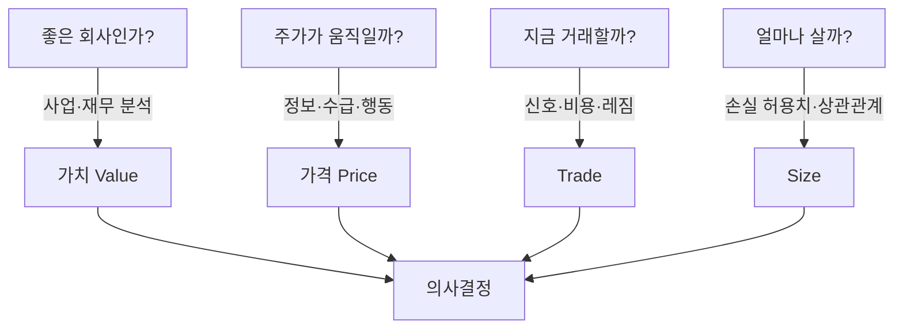
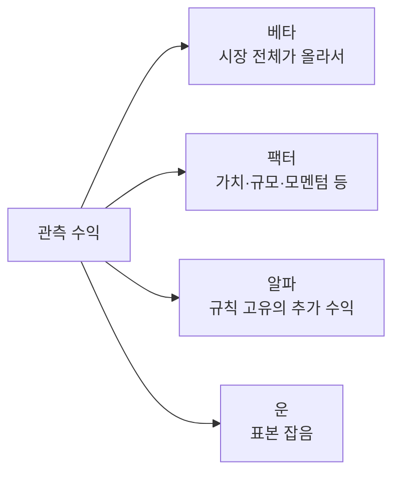
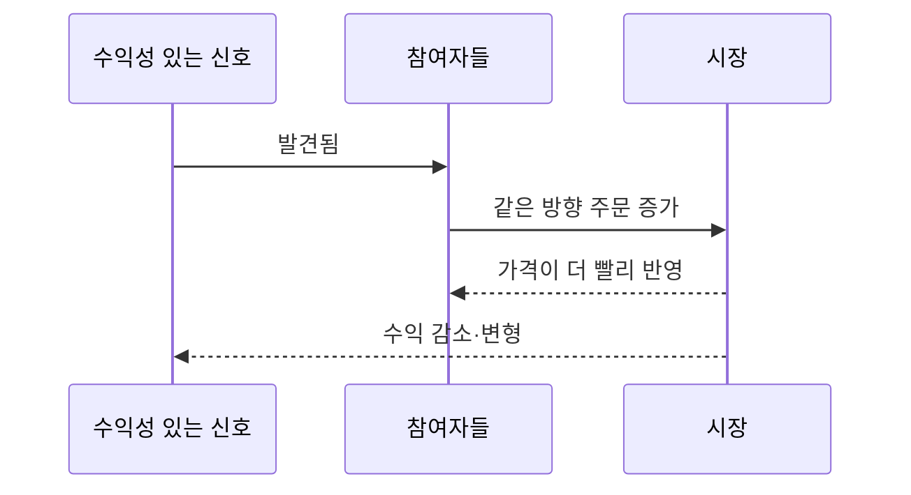

# 0. 투자와 자동매매의 Mental Model

> 목표: `기업`, `가격`, `전략`, `리스크`, `시스템`을 한 덩어리로 보지 않는다.  
> 예상 시간: 10분

## 한 장 요약

- **투자**는 미래 현금흐름을 얻기 위해 현재 자본을 배치하는 일이다.
- **트레이딩**은 가치뿐 아니라 수급, 정보 반영 속도, 투자자 행동 때문에 생기는 가격 변화를 거래한다.
- **자동매매 시스템**은 불확실한 가설을 반복 실행하되, 틀렸을 때 손실을 제한하는 제어 시스템이다.
- 좋은 회사, 오를 주식, 지금 매수하기 좋은 가격은 서로 다른 질문이다.



## 1. 가치, 가격, 수익률을 분리하자

| 개념 | 뜻 | 대표 입력 | 흔한 착각 |
|---|---|---|---|
| 가치(value) | 미래에 받을 현금흐름의 현재가치 | 이익, 현금흐름, 성장, 위험 | 좋은 회사면 어떤 가격에도 좋은 주식이다 |
| 가격(price) | 지금 매수자와 매도자가 합의한 교환가 | 정보, 수급, 유동성, 심리 | 가격이 내재가치로 즉시 돌아간다 |
| 수익률(return) | 투입 자본 대비 얻거나 잃은 비율 | 매수가, 매도가, 배당, 비용 | 방향만 맞으면 수익이다 |
| 리스크(risk) | 기대와 다른 결과, 특히 회복하기 어려운 손실 | 변동성, 갭, 상관, 유동성 | 손절가를 넣으면 손실이 고정된다 |

예를 들어 훌륭한 회사도 시장 기대가 지나치게 높아 비싼 가격에 사면 손실을 낼 수 있다. 반대로 부실한 회사도 단기 숏커버나 테마 수급으로 급등할 수 있다. **사업의 질과 거래의 질은 시간축이 다르다.**

## 2. 수익의 세 가지 출처

수익이 보이면 먼저 어디서 왔는지 분해한다.



- **베타(beta)**: 시장에 노출된 대가. 상승장에서 아무 때나 주식을 사도 벌 수 있다.
- **팩터(factor)**: 여러 종목에 공통으로 작용하는 특성. 가치, 규모, 수익성, 모멘텀 등이 대표적 연구 대상이다.
- **알파(alpha)**: 시장·팩터 노출과 비용을 설명하고도 남는 전략 고유 성과.
- **운(luck)**: 짧은 표본, 소수 대박 거래, 파라미터 탐색으로 생긴 우연.

따라서 “백테스트가 플러스다”보다 “동일한 기간·보유시간·비용의 무작위 진입보다 낫다”가 더 강한 질문이다.

## 3. 예측 시스템이 아니라 확률 시스템

자동매매는 다음 가격을 정확히 맞히는 함수가 아니다.

```text
관측 정보 X에서
상승/하락의 확률분포가 평소보다 조금 유리할 때만 진입하고,
불리한 꼬리 결과가 계좌를 망치지 않도록 크기를 제한하는 시스템
```

정확도 45%여도 평균 이익이 평균 손실보다 충분히 크면 돈을 벌 수 있다. 정확도 80%여도 가끔 나는 손실이 매우 크면 파산할 수 있다. 이 때문에 전략 평가는 분류 정확도보다 **비용 후 기대값과 손실 분포**가 중심이다.

## 4. 시장은 경쟁 환경이다

일반 소프트웨어의 입력 분포도 변하지만, 시장은 참여자가 서로 적응한다.



신호가 공개되고 자금이 몰리면 선반영, 경쟁 주문, 시장충격 때문에 엣지가 약해진다. 그래서 과거에 존재했다는 사실과 현재 거래 가능하다는 사실은 다르다.

## 5. 현재 시스템에 대입하면

현재 저장소의 전략 코드는 인트라데이 모멘텀과 이동평균 하회 평균회귀를 둘 다 담고 있고, **라이브는 2026-06-29부터 평균회귀(`below_ma`, MA20)만** 쓴다. 두 모드는 경제적 가정이 반대다.

- 모멘텀: “최근 강세가 단기적으로 지속된다.”
- 평균회귀: “최근 약세가 일시적이며 기준 수준으로 되돌아간다.”

따라서 후보 점수만 높이는 것보다 다음을 별도 기록해야 한다.

```yaml
hypothesis: "왜 이 신호가 비용 후 수익을 내야 하는가"
horizon: "몇 분/시간/일 안에 실현되어야 하는가"
invalid_when: "어떤 레짐에서 가정이 깨지는가"
exit_logic: "가설 실현/실패/시간 만료를 어떻게 판정하는가"
risk_budget: "한 번 틀렸을 때 계좌의 몇 %를 잃는가"
```

**2026-09-24 점검 결과** — 2절의 분해를 실제로 적용하자 헤드라인 숫자의 의미가 바뀌었다. 40거래일 동안 계좌 -1.44%, KOSPI +5.44%로 α -6.89%p였지만 평균 투자비중이 8.1%라 **약 절반은 현금 대기**였고 종목 선택분은 -3.54%p였다. 그리고 라이브 신호의 점수는 미래 수익과 상관이 0이었다(-0.014, n=320) — 평균회귀 가설이 이 구간(지수 상승장)에서 지지되지 않았다. 위 명세서의 `invalid_when`(추세장)이 코드에 없다는 것이 그 결과와 연결된다. 전체 점검은 [9장](09-system-theory-audit.md).

## 6. 챕터 종료 체크

- [ ] 좋은 기업과 좋은 매수 타이밍을 구분할 수 있다.
- [ ] 전략 수익을 베타, 팩터, 알파, 운으로 나눠 질문할 수 있다.
- [ ] 내 전략을 확정적 예측이 아니라 조건부 확률로 설명할 수 있다.
- [ ] 모멘텀과 평균회귀가 왜 반대 가정인지 설명할 수 있다.

## 참고자료

- [Investor.gov — Introduction to Investing](https://www.investor.gov/introduction-investing)
- [Fama & French — Common Risk Factors in the Returns on Stocks and Bonds](https://mba.tuck.dartmouth.edu/pages/faculty/ken.french/data_library/f-f_factors.html)
- [2013 Nobel Prize scientific background — Understanding Asset Prices](https://www.nobelprize.org/uploads/2013/10/advanced-economicsciences2013.pdf)
