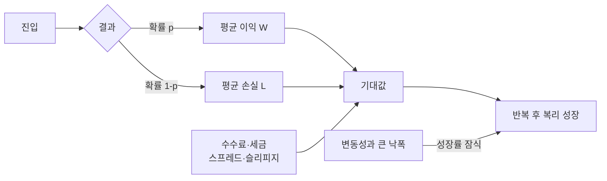

# 1. 수익률·복리·리스크

> 목표: 승률 대신 기대값, 복리, 낙폭으로 전략을 읽는다.  
> 예상 시간: 20분

## 한 장 요약

- 전략의 최소 단위는 `승률`이 아니라 **비용 후 기대값**이다.
- 산술평균 수익률이 같아도 변동성이 크면 장기 복리 성장은 낮아진다.
- 최대낙폭(MDD)은 과거 최악의 결과이지, 미래 손실의 상한이 아니다.
- 수익을 크게 만드는 것보다 파산하지 않는 것이 복리의 전제다.

## 1. 수익률의 기본

배당을 포함한 단순 수익률은 다음과 같다.

$$
r = \frac{P_1-P_0+D}{P_0}
$$

- $P_0$: 매수가
- $P_1$: 매도가 또는 평가가
- $D$: 보유 중 받은 배당 등 현금흐름

여러 기간의 수익은 더하는 것이 아니라 곱한다.

$$
V_T = V_0\prod_{t=1}^{T}(1+r_t)
$$

### 가장 중요한 직관

100에서 `+50%`면 150, 다시 `-50%`면 75다. 평균 변화율은 0%처럼 보이지만 자산은 **25% 감소**했다. 손실과 회복은 비대칭이다.

| 낙폭 | 원금 회복에 필요한 수익률 |
|---:|---:|
| -10% | +11.1% |
| -20% | +25.0% |
| -30% | +42.9% |
| -40% | +66.7% |
| -50% | +100.0% |

이 표가 손실 제한을 수익 극대화보다 먼저 설계해야 하는 이유다.

## 2. CAGR과 로그수익률

연평균 복리수익률(CAGR)은 시작과 끝을 일정한 연간 성장률로 바꾼 값이다.

$$
CAGR = \left(\frac{V_T}{V_0}\right)^{1/n}-1
$$

로그수익률은 $\ln(P_1/P_0)$이며 기간별로 더할 수 있어 연구에 편리하다. 다만 사용자가 실제로 경험하는 계좌 변화와 주문 손익 표시는 보통 단순 수익률이 더 직관적이다. 둘을 한 계산 안에서 무심코 섞지 않는다.

## 3. 기대값: 전략의 엔진

평균 이익을 $W$, 평균 손실의 절댓값을 $L$, 승률을 $p$, 거래당 총비용을 $C$라 하면:

$$
E[R] = pW - (1-p)L - C
$$

비용을 무시한 손익분기 승률은:

$$
p_{BE} = \frac{L}{W+L}
$$

예를 들어 목표 이익 `+8%`, 손절 `-3%`라면 이론상 손익분기 승률은 약 `27.3%`다. 그러나 실제로는 다음 때문에 더 높아진다.

- 수수료와 세금
- 매수·매도 호가 차이
- 신호 시점과 체결 시점 차이
- 갭 하락과 슬리피지
- 부분체결·미체결로 인한 포지션 왜곡

반대로 승률 70%인 전략도 30%의 손실이 아주 크면 기대값이 음수다.

## 4. 변동성은 복리 비용이다

수익률이 비교적 작다는 근사 아래 기하평균 성장률은 대략 다음 관계를 가진다.

$$
g \approx \mu - \frac{\sigma^2}{2}
$$

같은 산술평균 $\mu$라면 변동성 $\sigma$가 클수록 복리 성장률이 낮아진다. 이를 **volatility drag**라고 이해하면 된다.

주의할 점은 변동성이 리스크의 전부는 아니라는 것이다. 특히 자동매매에는 다음이 더 치명적일 수 있다.

- 거래정지로 팔 수 없음
- 호가 공백으로 손절가 아래에서 체결
- 여러 종목이 동시에 하락하는 상관관계 급등
- API 장애로 실제 포지션을 모르는 상태
- 손익 분포의 두꺼운 꼬리와 극단값

## 5. 자주 쓰는 성과 지표

| 지표 | 답하는 질문 | 함정 |
|---|---|---|
| 기대값 | 거래 한 번당 평균적으로 얼마 버는가? | 표본이 작으면 불안정 |
| 승률 | 이긴 거래의 비율은? | 손익 크기를 무시 |
| payoff | 평균 이익 / 평균 손실은? | 극단값에 민감 |
| profit factor | 총이익 / 총손실은? | 시간과 자본 사용량을 무시 |
| CAGR | 실제 복리 성장 속도는? | 큰 중간 낙폭을 숨길 수 있음 |
| 변동성 | 수익률이 얼마나 흔들리는가? | 유동성·갭·운영 위험을 못 봄 |
| Sharpe | 위험 대비 초과수익은? | 비정규·자기상관·다중검정에 취약 |
| Sortino | 하방 변동성 대비 수익은? | 목표수익률 선택에 영향 |
| MDD | 과거 고점 대비 최대 손실은? | 미래 최악의 상한이 아님 |
| turnover | 얼마나 자주 자본을 회전시키는가? | 비용 모델이 틀리면 의미가 왜곡 |

한 지표로 승인하지 말고 `기대값 + 신뢰구간 + MDD + turnover + tail loss + OOS`를 묶어 본다.

## 6. Sharpe를 읽는 최소한의 방법

$$
Sharpe = \frac{E[R-R_f]}{\sigma(R-R_f)}
$$

동일한 주기와 동일한 비용 가정으로 전략을 비교할 때 유용하다. 그러나 다음이면 숫자가 부풀 수 있다.

- 수익률이 독립적이지 않음
- 옵션 매도처럼 평소 작게 벌고 가끔 크게 잃음
- 많은 전략 중 가장 좋은 것만 선택함
- 거래가 뜸한데 관측 빈도를 과하게 연환산함

따라서 Sharpe는 합격증이 아니라 요약 통계다. 여러 파라미터를 시험했다면 [7장](07-backtest-and-statistics.md)의 Deflated Sharpe를 함께 본다.

## 7. 현재 시스템에 대입하면

[`backtest/engine.py`](../../backtest/engine.py)는 거래별 비용 후 수익, 승률, 기대값, payoff, 복리 수익과 MDD를 계산한다. 이 구조는 좋은 출발점이지만 해석할 때 다음을 확인한다.

1. `fee_pct`와 `tax_pct`가 현재 계좌·시장·상품에 맞는가?
2. 스프레드와 슬리피지가 별도로 반영되는가?
3. 거래별 수익을 순서대로 곱한 equity가 동시 보유와 현금 제약을 재현하는가?
4. 일봉 내 손절·익절 동시 도달 시 손절 우선 가정이 충분히 보수적인가?
5. 기대값의 bootstrap 신뢰구간이 0을 안정적으로 넘는가?

**2026-09-24 점검 결과** — 3절의 기대값 공식을 라이브 체결(n=5)에 대입하면 설계와 실현이 갈라진다.

| | 평균 이익 | 평균 손실 | 손익분기 승률 |
|---|---|---|---|
| 설계 (손절 -4% / 익절 +8%, 비용 0.23%) | +8% | -4% | 약 35% |
| 실현 (순손익) | +3.85% | -3.02% | 약 44% |

실현 승률은 40%라 기대값은 거래당 **-0.27%**다. 손익비를 1:2에서 1:1.27로 압축한 것은 Tier 1 규칙이 아니라 agent의 조기 청산이었다. 표본이 작아 통계적 결론은 아니지만, **설계한 손익비가 실제로 실현되는지**는 별도로 추적해야 하는 값이다. 상세는 [9장 6절](09-system-theory-audit.md#6-손익비와-사이징-16장).

## 8. 챕터 종료 체크

- [ ] 승률과 payoff만으로 기대값을 계산할 수 있다.
- [ ] `+50%, -50%`가 왜 -25%인지 설명할 수 있다.
- [ ] MDD가 미래 손실 상한이 아님을 이해한다.
- [ ] Sharpe가 높아도 실패할 수 있는 조건을 세 가지 이상 말할 수 있다.

## 참고자료

- [Investor.gov — Compound Growth와 Managing Risk](https://www.investor.gov/introduction-investing)
- [Investor.gov — What is Risk?](https://www.investor.gov/introduction-investing/investing-basics/what-risk)
- [Bailey & López de Prado — The Deflated Sharpe Ratio](https://papers.ssrn.com/sol3/papers.cfm?abstract_id=2460551)

