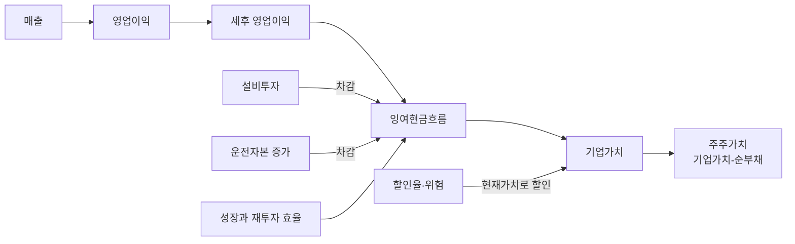
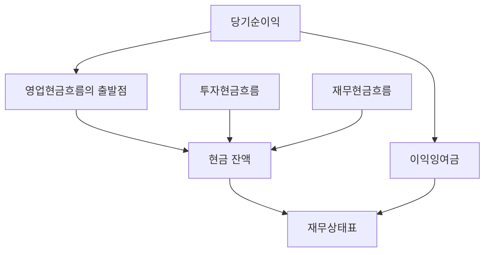
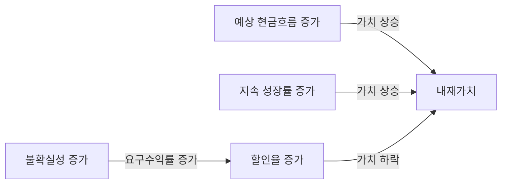
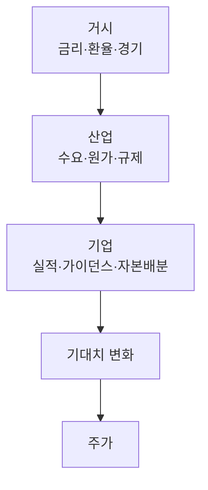

# 2. 기업·재무제표·가치평가

> 목표: 주가를 숫자 패턴으로만 보지 않고, 그 뒤의 사업과 현금흐름을 읽는다.  
> 예상 시간: 25분

## 한 장 요약

- 보통주는 기업의 비용과 채무를 지급한 뒤 남는 가치에 대한 **잔여청구권**이다.
- 기업가치는 미래 현금흐름, 성장, 위험의 함수다.
- `좋은 기업`과 `싼 주식`은 다르며, 가치와 가격의 차이가 수익 기회 또는 분석 오류다.
- 인트라데이 전략에서 펀더멘털은 보통 진입 타이밍보다 **유니버스·품질·이벤트 위험 필터**로 더 유용하다.

## 1. 세 재무제표를 하나의 이야기로 보기

| 재무제표 | 한 문장 | 핵심 질문 |
|---|---|---|
| 손익계산서 | 일정 기간 얼마나 팔고 남겼는가 | 매출 성장과 마진이 지속 가능한가? |
| 재무상태표 | 특정 시점 무엇을 갖고 무엇을 빚졌는가 | 부채와 유동성 위험을 감당할 수 있는가? |
| 현금흐름표 | 실제 현금이 어디서 들어오고 나갔는가 | 회계이익이 현금으로 전환되는가? |

연결 관계를 단순화하면 다음과 같다.

순이익이 늘어도 매출채권·재고가 더 빠르게 늘면 현금은 부족할 수 있다. 반대로 큰 감가상각 때문에 순이익이 작아도 현금창출은 양호할 수 있다. 자동 스크리닝에서는 한 지표보다 **이익의 질**을 본다.

## 2. 꼭 알아둘 기본 지표

| 영역 | 지표 | 직관 | 주의점 |
|---|---|---|---|
| 성장 | 매출·영업이익 성장률 | 사업이 커지는 속도 | 기저효과와 일회성 |
| 수익성 | 영업이익률 | 매출 1원당 영업이익 | 업종 간 직접 비교 곤란 |
| 자본효율 | ROE, ROIC | 투입 자본으로 얼마나 버는가 | 높은 부채가 ROE를 부풀릴 수 있음 |
| 안정성 | 부채비율, 이자보상배율 | 빚을 감당할 여력 | 금융업은 해석 방식이 다름 |
| 현금 | CFO, FCF | 장부이익이 현금인가 | 성장기의 CAPEX는 맥락 필요 |
| 희석 | 주식수 변화 | 내 지분 몫이 줄어드는가 | 스톡옵션·CB/BW 포함 확인 |

ROIC가 자본비용보다 높은 상태에서 재투자할 수 있어야 성장이 가치를 만든다. 성장률만 높고 매출 1원을 만들 때마다 더 많은 자본이 필요하면 성장은 현금을 소모한다.

## 3. DCF의 직관

DCF(현금흐름할인법)는 미래 돈을 오늘의 돈으로 바꾸는 계산이다.

$$
Value = \sum_{t=1}^{n}\frac{CF_t}{(1+r)^t} + \frac{Terminal\ Value}{(1+r)^n}
$$

- $CF_t$: 미래 현금흐름
- $r$: 그 현금흐름의 위험을 반영한 할인율
- `Terminal Value`: 명시적 예측 이후의 가치

기업 전체 현금흐름의 단순한 형태는 다음과 같다.

$$
FCFF = EBIT(1-T) + D\&A - CAPEX - \Delta NWC
$$

FCFF는 WACC로 할인해 기업가치(EV)를 구하고, 대략 `EV - 순부채`를 통해 주주가치로 이동한다. 주주에게 귀속되는 FCFE를 쓴다면 자기자본비용으로 할인한다. **현금흐름과 할인율의 대상을 섞지 않는 것**이 핵심이다.

### 민감도 직관

먼 미래 현금흐름 비중이 큰 성장주는 할인율 변화에 더 민감하다. 금리 상승기에 같은 이익 전망이어도 밸류에이션이 압축될 수 있는 이유다.

## 4. 상대가치: PER이 낮으면 싼가?

| 배수 | 대략적인 뜻 | 잘 맞는 경우 | 대표 함정 |
|---|---|---|---|
| PER | 주가 / 주당순이익 | 이익이 양수이고 안정적 | 경기고점의 이익으로 계산하면 싸 보임 |
| PBR | 시가총액 / 장부자본 | 금융·자산 중심 업종 | 무형자산 중심 기업 비교에 취약 |
| EV/EBITDA | 기업가치 / 영업현금창출 근사 | 자본구조가 다른 기업 비교 | CAPEX와 운전자본을 무시 |
| PSR | 시가총액 / 매출 | 적자 성장기업 | 매출이 이익이 될 보장 없음 |
| FCF yield | FCF / 시가총액 | 현금창출이 안정적 | 일시적 운전자본 변화에 왜곡 |

배수는 성장, 위험, 수익성이 비슷한 기업끼리 비교해야 한다. 업종이 다르거나 회계정책이 다르면 “낮다”는 사실만으로 저평가를 뜻하지 않는다.

## 5. 가격을 흔드는 정보의 층

주가는 “실적이 좋은가”보다 **시장 예상보다 얼마나 달라졌는가**에 자주 반응한다. 매출이 20% 성장했어도 예상이 30%였다면 하락할 수 있다. 이벤트 기반 시스템은 발표값뿐 아니라 컨센서스 대비 surprise와 유동성 변화를 구분해야 한다.

## 6. 인트라데이 자동매매에서의 사용법

펀더멘털을 밀리초 단위 진입 신호로 쓰기보다 다음 필터로 쓰는 편이 자연스럽다.

- 관리종목·거래정지·상장폐지·감사의견 등 생존 위험 제외
- 지나치게 낮은 유동성과 작은 시가총액 제외
- 실적 발표, 유상증자, CB/BW, 보호예수 해제 같은 이벤트 표기
- 부채·현금흐름·희석 위험이 큰 종목의 최대 포지션 축소
- 동일 업종 후보의 질과 밸류에이션 비교

현재 라이브는 펀더멘털을 **신호가 아니라 필터로만** 쓴다 — 시가총액 3조 원 이상(`min_market_cap_krw`)과 KOSPI 대형주 30종목 고정 로스터([`src/constants/universe.py`](../../src/constants/universe.py), 2026-08-18~)다. 이 장의 권고와 같은 방향이다. 다만 시가총액은 규모이지 품질이 아니므로, 부채·현금흐름·희석 같은 품질 필터는 아직 없다.

로스터 전환 전에는 거래대금 상위 리더보드를 유니버스로 썼는데, 그건 "오늘 움직인 종목"이라 평균회귀가 찾는 "조용히 눌린 종목"과 거의 여집합이었다. 유니버스는 필터이면서 동시에 전략 가설과 맞아야 한다.

⚠️ 장중 PER·ROE는 쓰지 않는다. 키움 피드의 재무 지표는 외부 벤더가 **주 1회 또는 실적 시즌**에 갱신하므로, 장중 PER의 변화는 분모가 지난주 값인 채로 가격만 움직인 동어반복이다.

⚠️ 고정 로스터는 **오늘의 대형주**로 고른 것이라 과거 백테스트에 생존편향을 만든다([7장 2절](07-backtest-and-statistics.md#2-자주-발생하는-편향)).

## 7. 챕터 종료 체크

- [ ] 손익계산서 이익과 현금흐름의 차이를 설명할 수 있다.
- [ ] 성장률이 높아도 가치가 훼손될 수 있는 경우를 안다.
- [ ] PER이 낮다는 이유만으로 저평가라 할 수 없는 이유를 안다.
- [ ] 내 인트라데이 전략에서 펀더멘털이 신호인지 필터인지 구분했다.

## 참고자료

- [DART 전자공시시스템](https://dart.fss.or.kr/)
- [Open DART — 공시정보 API](https://opendart.fss.or.kr/)
- [Aswath Damodaran — Valuation 개요](https://pages.stern.nyu.edu/~adamodar/New_Home_Page/lectures/val.html)
- [Aswath Damodaran — 2026 Valuation Lecture Notes](https://pages.stern.nyu.edu/~adamodar/New_Home_Page/eqlect.htm)

