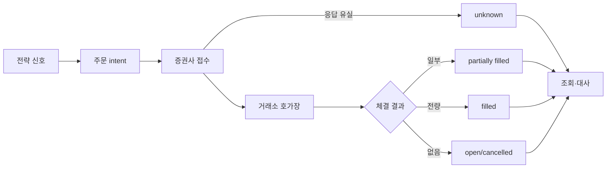
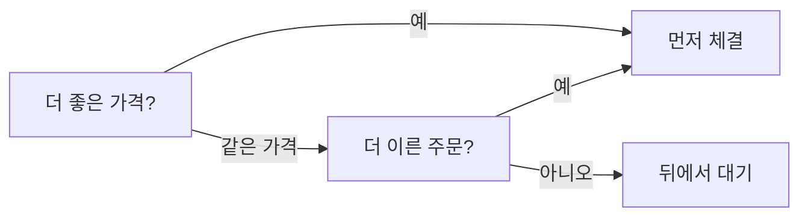
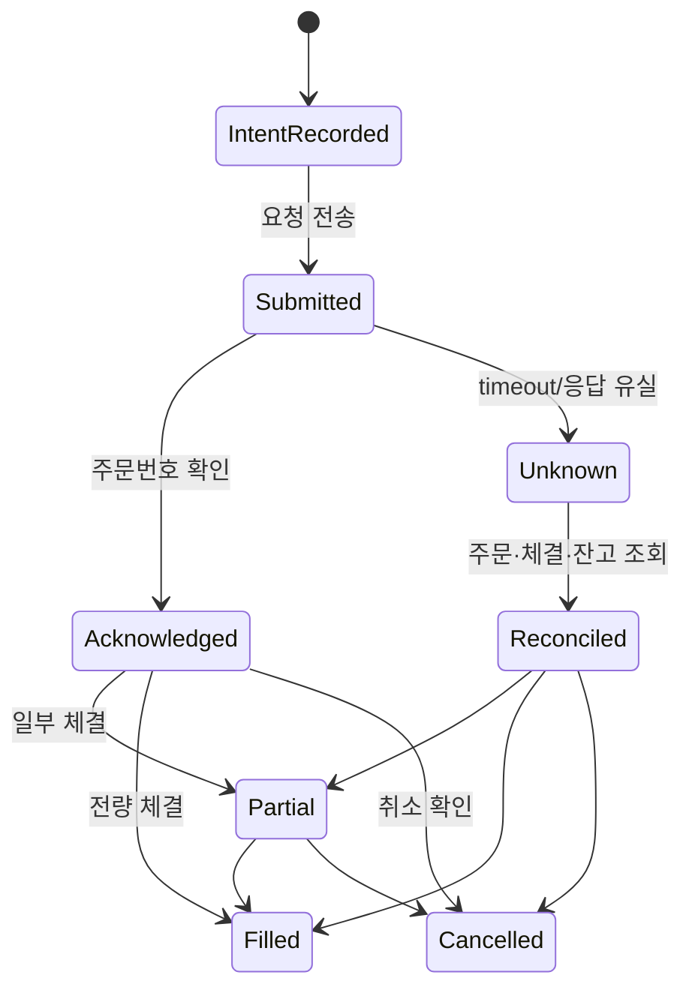

# 3. 시장 미시구조·주문·체결

> 목표: 차트의 가격과 실제로 거래 가능한 가격의 차이를 이해한다.  
> 예상 시간: 25분

## 한 장 요약

- `현재가`는 마지막 체결가이지, 내 주문의 체결 보장 가격이 아니다.
- 시장가는 가격을 포기하고 체결 가능성을 높이는 주문, 지정가는 체결 가능성을 포기하고 가격 상한·하한을 정하는 주문이다.
- 실현 손익은 신호보다 **스프레드, 대기열, 지연, 부분체결, 시장충격**에 크게 좌우된다.
- 주문 API 응답과 거래소 체결은 다른 상태다. timeout은 실패가 아니라 `결과 미확정(unknown)`일 수 있다.



## 1. 호가장(order book)의 직관

```text
매도호가  10,030원  800주
매도호가  10,020원  300주
매도호가  10,010원  100주  ← best ask
--------------------------
매수호가  10,000원  200주  ← best bid
매수호가   9,990원  500주
매수호가   9,980원  900주
```

- best bid: 지금 가장 비싸게 사겠다는 가격
- best ask: 지금 가장 싸게 팔겠다는 가격
- spread: `best ask - best bid`
- mid price: 두 최우선 호가의 중간값. 관측 기준일 뿐 대량 체결 보장 가격이 아니다.

위 상태에서 500주 시장가 매수를 내면 10,010원 100주, 10,020원 300주, 나머지는 그 위 호가에서 체결될 수 있다. 마지막 체결가가 10,000원이어도 평균 매수가는 더 높아진다.

## 2. 주문 유형의 핵심 trade-off

| 주문 | 내가 통제하는 것 | 포기하는 것 | 적합한 상황 |
|---|---|---|---|
| 시장가 | 수량 | 가격 | 즉시 청산이 가격보다 중요 |
| 지정가 | 최악 허용 가격 | 체결 여부·시간 | 진입 가격 규율이 중요 |
| IOC | 즉시 가능한 수량만 체결 | 잔량 유지 | 일부 체결을 허용하되 대기하지 않음 |
| FOK | 전량 즉시 체결 아니면 취소 | 부분체결 | 포지션 원자성이 꼭 필요 |
| 조건부/최유리 등 | 거래소·증권사 정의에 따름 | 단순성 | 정확한 세부 규칙 확인 후 사용 |

시장가는 “현재가로 주문”이 아니다. 반대편 호가를 가격 순서대로 소비하는 주문이다. 유동성이 얕거나 상·하한가 부근이면 예상과 크게 달라질 수 있다.

## 3. 가격우선·시간우선과 대기열

연속매매에서 더 유리한 가격이 먼저, 같은 가격이면 먼저 들어온 주문이 먼저 체결되는 것이 기본 직관이다.



백테스트에서 저가가 내 지정가를 찍었다고 해서 체결된 것은 아니다. 내 앞의 대기 물량을 소화했는지, 그 가격에 실제 거래량이 있었는지 알아야 한다.

## 4. 단일가매매와 연속매매

- **연속매매**: 반대 주문과 조건이 맞으면 즉시 체결된다.
- **단일가매매(call auction)**: 일정 시간 주문을 모아 하나의 가격에서 체결량을 최대화한다.

시가·종가 결정 구간은 평소 장중과 체결 방식이 다르다. 장 시작 직전 신호를 장중 시장가와 같은 모델로 시뮬레이션하면 체결 오차가 커질 수 있다.

## 5. 거래비용의 네 층

$$
Net\ Edge = Gross\ Edge - Fees - Taxes - Spread - Slippage - Impact
$$

| 비용 | 의미 | 포착 방법 |
|---|---|---|
| 명시적 비용 | 수수료·세금 | 계좌·상품별 실제율 |
| 스프레드 | 매수/매도 즉시 왕복의 가격 차 | 당시 best bid/ask |
| 슬리피지 | 의사결정 가격과 평균 체결가 차 | 주문별 arrival price 대비 VWAP |
| 시장충격 | 내 주문이 가격을 움직인 효과 | 주문 크기/호가 깊이/거래량 분석 |

거래 빈도가 높고 목표수익이 작을수록 비용 모델이 전략 모델만큼 중요하다.

## 6. KRX 현물 주식에서 기억할 점

2026-08-04에 확인한 KRX 최신 가이드 기준의 큰 틀은 다음과 같다.

- 정규시장: `09:00~15:30`
- 정규장 연속매매: 가격우선·시간우선이 기본
- 시가·종가: 단일가매매 구간 존재
- 일반 주식의 일일 가격제한폭: 기준가격 대비 `±30%`
- 주문 종류와 허용 조건은 시장·상품·시간대에 따라 다름

**세금 (2026-09-24 확인)** — 비용 모델에서 가장 큰 항목이다.

| 상품 | 매도 시 세금 | 수수료 포함 왕복 비용(이 저장소 가정) |
|---|---|---|
| 코스피 주식 | 증권거래세 0.05% + 농어촌특별세 0.15% = **0.20%** (2026-01-01~) | **0.23%** |
| 코스닥 주식 | 증권거래세 0.20% | 약 0.23% |
| 국내 상장 ETF | **증권거래세 없음** (매매차익 과세는 ETF 유형별로 다름) | 수수료 수준(약 0.03%) + 스프레드 |

코스피 왕복 비용의 87%가 세금이다. 인트라데이처럼 회전이 잦은 전략은 이 한 줄이 엣지의 상한을 정한다([9장 5절](09-system-theory-audit.md#5-수확-가능성-병목은-점수가-아니다-135장)). 세율은 법 개정으로 해마다 바뀔 수 있다 — 코스피 거래세는 2025년 0%였다가 2026년 0.05%로 올랐다.

이 값들을 전략 코드에 영구 상수로 복사하기 전에 [KRX 최신 거래 가이드 PDF](https://global.krx.co.kr/contents/GLB/01/0109/0109000000/guide_to_trading_in_the_korean_stock_market.pdf), KRX 규정, 키움 주문 API의 실제 허용값을 함께 확인한다.

## 7. 주문 시스템의 상태 모델

가장 위험한 버그는 timeout 뒤 같은 주문을 다시 보내 중복 포지션을 만드는 것이다.



원칙은 세 가지다.

1. 주문 전 intent를 내구성 있게 기록한다.
2. 결과가 unknown이면 재주문 전에 반드시 브로커 상태를 조회한다.
3. 주문, 체결, 잔고 세 관점이 일치할 때만 상태를 확정한다.

현재 저장소의 [`src/services/order_result.py`](../../src/services/order_result.py)와 [`src/services/order_ledger.py`](../../src/services/order_ledger.py)가 이 상태 모델을 구현하고 있고, 2026-08-13부터 실거래에서 동작 중이다.

- 주문 전 `INTENDED`를 SQLite(로컬 블록 스토리지, NFS 금지)에 commit하고, timeout·5xx는 `unknown`으로 두어 **재전송하지 않는다.**
- `submitted`(접수)와 `filled`(체결)을 분리하고, `filled`는 브로커 대사에서만 만든다.
- 번호 없는 intent는 시각까지 맞아야 브로커 행과 매칭한다 — 오전 체결이 오후의 미확정 주문을 체결로 바꾸던 결함을 막는다.
- 실시간 체결 통보(웹소켓)는 대사를 빠르게 할 뿐, 진실원천은 여전히 폴링 조회다.

주문 유형은 이 장의 trade-off를 그대로 따른다. Tier 1 손절·익절과 agent의 `CUT_LOSS`는 **시장가**(체결 자체가 목적), agent의 익절·일부매도는 **최우선 매수호가 지정가**(가격 규율)다. 지정가는 미체결로 남을 수 있어 5분 뒤 자동 취소한다. 호가를 못 읽으면 막힌 청산이 더 위험하므로 시장가로 내려간다.

## 8. 챕터 종료 체크

- [ ] 현재가와 내가 체결할 수 있는 가격을 구분한다.
- [ ] 시장가와 지정가의 trade-off를 설명할 수 있다.
- [ ] 백테스트에서 `low <= limit`만으로 체결을 확정하면 안 되는 이유를 안다.
- [ ] timeout 주문을 즉시 재전송하면 안 되는 이유를 안다.

## 참고자료

- [KRX — Guide to Trading in the Korean Stock Market](https://global.krx.co.kr/contents/GLB/01/0109/0109000000/guide_to_trading_in_the_korean_stock_market.pdf)
- [KRX — 유가증권시장 주문 유형](https://regulation.krx.co.kr/contents/RGL/03/03010100/RGL03010100T2.jsp)
- [SEC Investor Bulletin — Trading Basics](https://www.sec.gov/file/trading101basicspdf)

