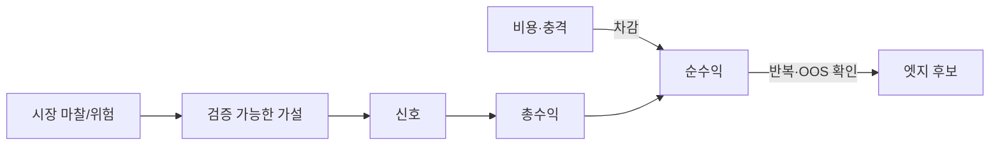
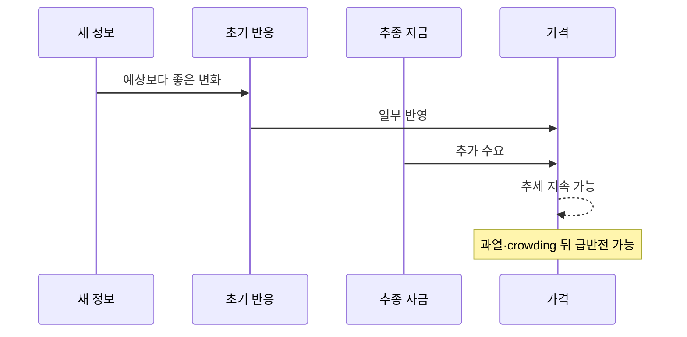
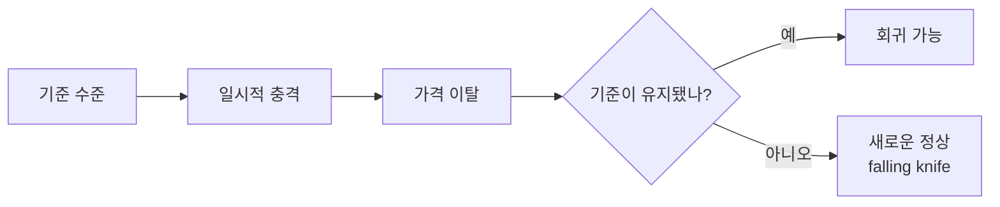
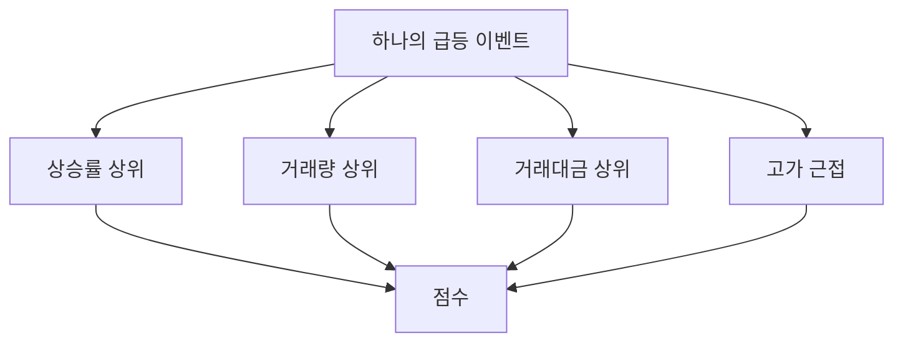

# 4. 전략 계열과 엣지

> 목표: 지표 이름보다 전략이 전제하는 가격 행동과 실패 조건을 이해한다.  
> 예상 시간: 25분

## 한 장 요약

- 엣지는 “잘 맞는 지표”가 아니라 **반복 가능한 이유가 있는 비용 후 조건부 기대수익**이다.
- 모멘텀은 지속을, 평균회귀는 반전을 산다. 같은 관측값을 반대로 해석할 수 있다.
- 학술적으로 관측된 중기 모멘텀이 특정 인트라데이 규칙을 자동으로 정당화하지 않는다.
- 전략에는 진입 규칙뿐 아니라 시간축, 무효화 조건, 청산, 비용, 용량이 포함된다.

## 1. 시장 효율성과 엣지

시장이 정보를 즉시 완벽히 반영한다면 공개 정보만으로 위험조정 초과수익을 지속하기 어렵다. 현실에서는 다음 마찰 때문에 일시적 기회가 생길 수 있다.

- 정보가 참여자에게 도달하고 해석되는 속도 차이
- 손실회피, 과소·과잉반응 같은 행동 편향
- 기관의 벤치마크, 리밸런싱, 자금 유출입 제약
- 유동성 제공에 대한 보상
- 위험을 떠안는 대가
- 거래·공매도·자본 제약



엣지의 실무적 정의는 다음처럼 생각할 수 있다.

$$
Edge(X)=E[R_{future}\mid X]-E[R_{baseline}]-Trading\ Costs
$$

`X`라는 조건에서 얻는 미래 수익이 같은 시장 노출의 기준선과 비용을 넘는가가 핵심이다.

## 2. 대표 전략 계열

| 전략 | 핵심 가정 | 보통 보는 것 | 잘 되는 환경 | 대표 실패 |
|---|---|---|---|---|
| 추세·모멘텀 | 오른 것이 당분간 더 오른다 | 수익률, 신고가, 거래량 | 정보가 천천히 반영되는 방향성 장 | 급반전, crowded trade |
| 평균회귀 | 일시적 이탈이 기준으로 돌아온다 | z-score, 이동평균 이격 | 범위장, 과잉반응 후 안정 | 구조적 악재·추세장 |
| 가치 | 가격이 펀더멘털보다 싸다 | 현금흐름, 배수 | 긴 시간축, 재평가 | value trap, 촉매 부재 |
| 품질 | 좋은 사업의 성과가 지속된다 | ROIC, 마진, 부채, 현금 | 장기 복리 | 과도한 가격 지불 |
| 이벤트 | 새 정보의 반영이 불완전하다 | 실적 surprise, 공시 | 명확한 정보 충격 | 선반영, 해석 오류, 갭 |
| 유동성 공급 | 조급한 주문에 반대편을 제공한다 | spread, order flow | 양방향 흐름·깊은 호가 | 정보 보유자에게 역선택 |

전략 계열이 같아도 시간축이 다르면 다른 전략이다. `12개월 상대강도`와 `5분 돌파`는 모두 모멘텀이라 부르지만 데이터 생성 과정, 비용, 위험이 다르다.

## 3. 모멘텀의 직관



Jegadeesh와 Titman의 고전 연구는 과거 승자 매수·패자 매도 전략이 이후 3~12개월에 양의 성과를 보였다고 보고했다. 이것은 **중기 횡단면 모멘텀의 역사적 증거**이지, 한국 주식 인트라데이에서 당일 상승률 상위 종목을 추격하면 번다는 직접 증거가 아니다.

모멘텀 전략이 확인해야 할 것:

- 강세의 원인이 정보인지 단순 잡음인지
- 거래량 증가가 새로운 수요인지 막판 분출인지
- 상한가 근처에서 기대 이익보다 갭·미체결 위험이 큰지
- 시장 전체가 risk-off일 때 신호의 성과가 어떻게 변하는지
- 같은 방향 포지션이 한꺼번에 청산될 때의 tail loss

## 4. 평균회귀의 직관

평균회귀는 “싸졌으니 산다”가 아니라 **변하지 않은 기준 수준에서 일시적으로 이탈했다**는 가정이다.



이동평균은 기준의 추정치일 뿐 원인이 아니다. 실적 악화나 구조적 수급 변화로 공정가격 자체가 내려가면 이동평균 아래라는 이유만으로 반등하지 않는다.

평균회귀 전략에는 최소한 다음이 필요하다.

- 기준: VWAP, 이동평균, 페어 스프레드 등 무엇으로 돌아오는가?
- 정상성: 그 기준과 분포가 유지되는가?
- 촉매: 과매도 해소를 일으킬 주문 흐름이 있는가?
- 시간 제한: 언제까지 안 돌아오면 가설을 폐기하는가?
- 추세 필터: 구조적 하락과 일시적 이탈을 어떻게 나누는가?

## 5. 서로 상관된 신호를 중복 점수화하지 않기

`상승률 상위`, `거래량 상위`, `거래대금 상위`, `고가 근접`은 독립적인 네 증거처럼 보이지만 한 번의 급등이 모두를 동시에 만들 수 있다.



단순 합산하면 증거가 네 배가 아니라 **같은 증거를 네 번 센 것**일 수 있다. 현재 [`src/services/strategy.py`](../../src/services/strategy.py)가 leaderboard source bonus를 제한하는 이유와 연결된다. 더 나아가 각 feature의 상관, 중복 정보량, 제거 시 OOS 성능을 확인한다.

## 6. 좋은 전략 명세서

```yaml
name: intraday_momentum_v1
hypothesis: "새 정보와 수급이 당일에 점진적으로 반영된다"
universe: "거래 가능하고 충분히 유동적인 KRX 보통주"
signal_time: "미래 데이터 없이 계산 가능한 시점"
entry: "신호 + 레짐 + 유동성 조건"
exit:
  success: "목표 또는 추세 약화"
  failure: "가격/가설 무효화"
  timeout: "보유시간 만료"
cost_model: "수수료+세금+스프레드+크기별 슬리피지"
capacity: "호가 깊이와 거래대금 대비 주문 상한"
invalid_when: "급격한 risk-off, 거래정지, 데이터 stale"
```

지표를 추가하기 전에 이 명세서의 어떤 가정을 더 잘 측정하는지 설명하지 못하면 추가하지 않는다.

## 7. 현재 시스템에 대입하면

현재 점수 로직에는 모멘텀과 `below_ma`가 별도 분기로 존재한다. 다음 실험을 분리해야 한다.

1. 진입 모드별 거래를 별도 전략 ID로 기록
2. 모드별 비용 후 기대값과 MDD 계산
3. risk-on / neutral / risk-off별 성과 분해
4. source와 feature를 하나씩 제거하는 ablation test
5. 동일 빈도·동일 청산 규칙의 random-entry와 비교
6. 통합 포트폴리오에서는 두 전략의 동시 손실 상관관계를 계산

두 모드를 한 평균으로 합치면 한쪽의 엣지 붕괴를 다른 쪽이 가릴 수 있다.

**2026-09-24 점검 결과** — 위 5번(무작위 대조군)과 4번(ablation)을 라이브 데이터로 처음 수행했다.

- **라이브 점수에는 서열 정보가 없다.** 후보 저널 26세션·신호 303건에서 `corr(score, 당일 평균 제거 5일 수익률) = -0.014`. 점수 버킷도 단조롭지 않다(7점 +0.77% > 9점 -0.07%).
- **5절의 두 경고가 점수 안에 있었다.** ① 레짐 가점(+1/+2)과 스프레드 가점은 그날 모든 대형주에 같아 **순위를 바꾸지 못한다** — 선택 점수가 아니라 타이밍 게이트다. ② 평균회귀 점수에 "시가 위면 +1"이라는 **모멘텀 항목**이 섞여 있다.
- **재료별 정보량(rank IC)**: 현행 `ma20_dip`은 0(세 구간 모두 |t|<1.3), 전일 하락 반전 `rev_1d`는 +0.057로 세 구간 모두 안정, 저변동성은 최근 구간에서 소멸, 20일 모멘텀과 수급은 문턱 미달.
- **3장의 시간축 경고 재확인**: 학술적 중기 모멘텀(3~12개월)과 이 저장소의 20일·당일 신호는 다른 전략이다. 20일 모멘텀 IC는 0이었다.

결정적인 것은 정보가 있는 `rev_1d`조차 비용 0.23%와 1종목 포트폴리오에서는 수확되지 않는다는 점이다. 그래서 다음 설계의 첫 질문은 "어떤 점수"가 아니라 "어떤 비용 구조와 몇 종목"이다. [9장 3~5절](09-system-theory-audit.md).

## 8. 챕터 종료 체크

- [ ] 내 전략의 수익 이유를 지표 이름 없이 설명할 수 있다.
- [ ] 모멘텀과 평균회귀의 무효화 조건을 각각 말할 수 있다.
- [ ] 학술 연구의 시간축과 내 구현의 시간축을 구분한다.
- [ ] 서로 상관된 신호의 중복 점수 위험을 이해한다.

## 참고자료

- [Jegadeesh & Titman (1993) — Returns to Buying Winners and Selling Losers](https://onlinelibrary.wiley.com/doi/10.1111/j.1540-6261.1993.tb04702.x)
- Jegadeesh, N. (1990). Evidence of Predictable Behavior of Security Returns. *Journal of Finance* — 단기(1개월 이하) 반전
- Lehmann, B. (1990). Fads, Martingales, and Market Efficiency. *Quarterly Journal of Economics* — 주간 반전
- [Kenneth French Data Library — Fama/French Factors](https://mba.tuck.dartmouth.edu/pages/faculty/ken.french/data_library.html)
- [2013 Nobel Prize scientific background — Understanding Asset Prices](https://www.nobelprize.org/uploads/2013/10/advanced-economicsciences2013.pdf)
