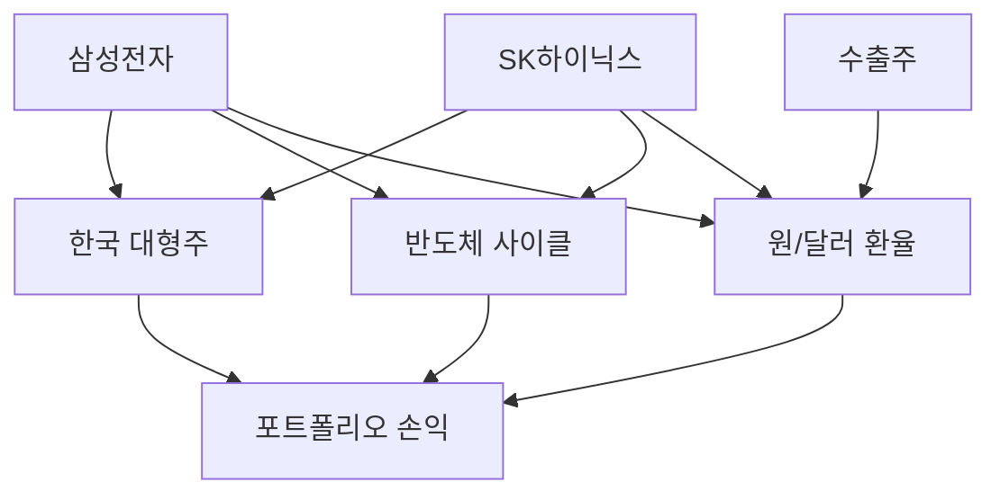
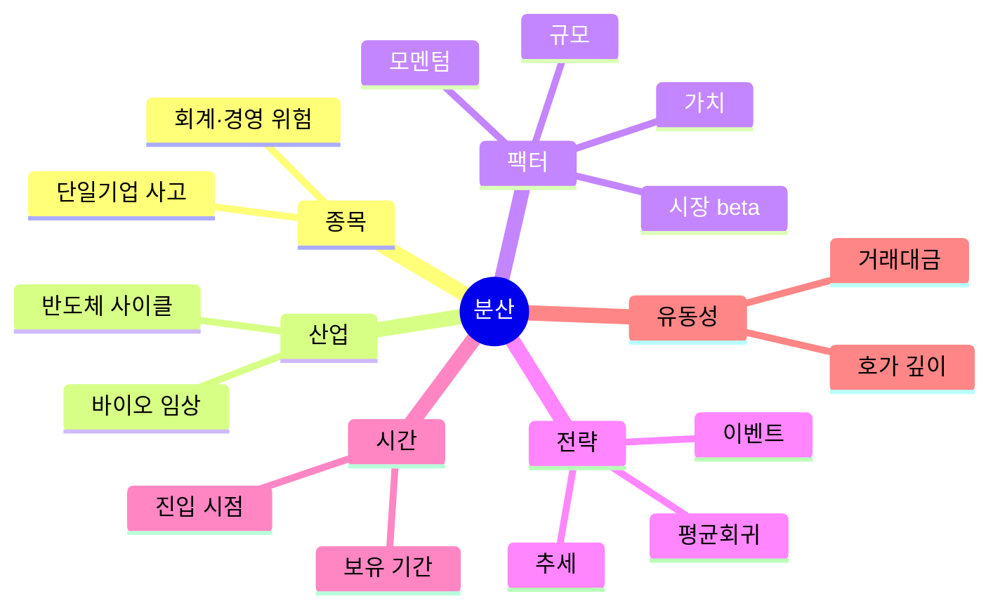
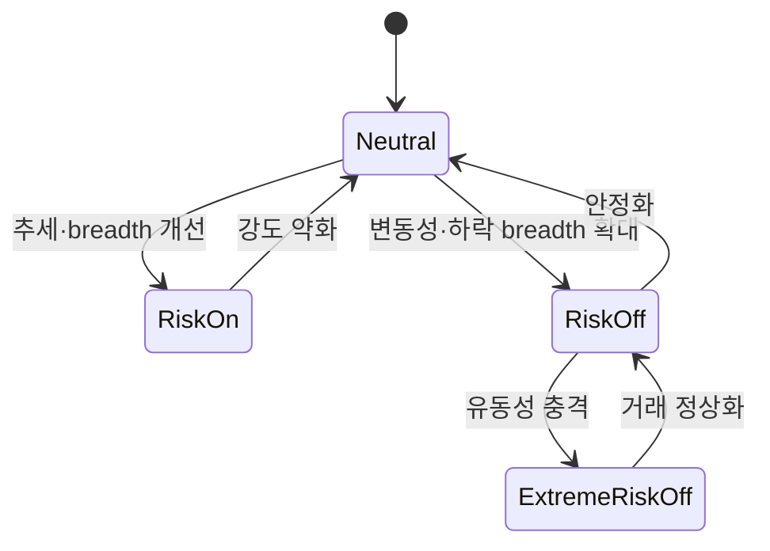

# 5. 포트폴리오·상관관계·레짐

> 목표: 개별 종목 신호를 계좌 수준의 위험으로 변환한다.  
> 예상 시간: 20분

## 한 장 요약

- 종목이 여러 개여도 같은 위험요인에 노출되면 분산이 아니다.
- 상관관계는 위기 때 높아질 수 있으므로 평상시 추정치만 믿지 않는다.
- 동일 금액 배분은 동일 위험 배분이 아니다.
- 레짐은 미래를 맞히는 라벨보다 **노출을 줄이거나 전략을 선택하는 상태 변수**로 쓰는 편이 안전하다.

종목명은 세 개지만 실제 손실 원인은 대형주·반도체·환율 몇 개에 집중될 수 있다.

## 1. 포트폴리오 수익과 위험

포트폴리오 수익률은 가중합이다.

$$
R_p=\sum_{i=1}^{N}w_iR_i
$$

두 자산의 분산은 다음처럼 상관관계를 포함한다.

$$
\sigma_p^2=w_1^2\sigma_1^2+w_2^2\sigma_2^2+2w_1w_2\rho_{12}\sigma_1\sigma_2
$$

$\rho$가 1보다 작을 때 분산 효과가 생긴다. 하지만 과거 상관이 낮았다는 사실이 급락장에서 낮게 유지된다는 보장은 없다. 유동성 위기에는 서로 다른 자산도 “현금 확보”라는 한 원인으로 함께 팔린다.

## 2. 무엇을 분산해야 하는가

가장 중요한 것은 종목 수가 아니라 **동시에 실패할 이유의 수**다.

## 3. 베타와 팩터 노출

시장 베타는 시장이 1 움직일 때 종목이 평균적으로 얼마나 움직였는지를 나타내는 회귀 계수다.

$$
\beta_i=\frac{Cov(R_i,R_m)}{Var(R_m)}
$$

- beta 1.3: 과거 표본에서 시장 변화에 더 민감했음
- beta 0.7: 상대적으로 덜 민감했음
- beta는 고정된 기업 속성이 아니라 기간과 레짐에 따라 변하는 추정치

팩터 모델의 직관은 수익을 공통 원인과 잔여분으로 나누는 것이다.

$$
R_i-R_f=\alpha_i+\beta_m MKT+\beta_s SMB+\beta_v HML+\epsilon_i
$$

표기보다 중요한 질문은 “내 전략 수익이 사실상 시장 상승, 대형주, 특정 산업, 모멘텀 노출로 설명되는가?”다. 설명되고 남은 안정적인 부분만 알파 후보로 본다.

## 4. 동일 금액과 동일 위험은 다르다

두 종목에 각각 1천만 원을 투자해도 일 변동성이 2%와 6%라면 두 번째 종목이 대략 세 배의 변동 위험을 기여한다. 기본적인 변동성 조정은 다음처럼 생각할 수 있다.

$$
Position\ Weight \propto \frac{1}{Estimated\ Volatility}
$$

실전에서는 무제한 역변동성 대신 다음 상한을 함께 둔다.

- 종목별 최대 금액
- 산업·테마별 최대 합산 노출
- 저유동 종목 최대 참여율
- 전략별 최대 포지션 수
- 전체 gross/net exposure

## 5. 레짐이란 무엇인가

레짐은 시장의 수익·변동·상관·유동성 특성이 일정 기간 달라지는 상태다.

| 축 | 낮은 상태 | 높은 상태 | 전략 영향 예시 |
|---|---|---|---|
| 추세 | 방향 없는 범위장 | 강한 방향성 | 평균회귀 ↔ 모멘텀 |
| 변동성 | 잔잔함 | 급격한 변동 | 포지션 축소·스프레드 확대 |
| 유동성 | 깊은 호가 | 얕은 호가 | 슬리피지·미체결 증가 |
| breadth | 소수만 상승 | 다수 상승 | 지수와 개별주 신호의 신뢰 차이 |
| 상관 | 종목별 차별화 | 동반 움직임 | 분산효과 감소 |

라벨 경계 근처에서 매 cycle 상태가 뒤집히는 것을 막기 위해 hysteresis, 최소 유지시간, 신뢰도 점수를 사용할 수 있다.

## 6. 거시지표는 맥락이지 즉시 신호가 아니다

금리, 수익률곡선, 환율, 신용스프레드는 자산의 할인율과 위험선호에 영향을 준다. 하지만 발표 지연, 개정, 시장 선반영 때문에 단일 지표를 당일 매수 버튼으로 바로 연결하면 위험하다.

아래 이미지는 FRED가 실시간 생성하는 미국 10년-2년 국채 금리차다. 장단기 금리차의 **형태와 변화**를 보는 예시이며 KRX 단기 매수 신호가 아니다.

국내 주식 레짐 후보 입력:

- KOSPI/KOSDAQ 추세와 변동성
- 상승·하락 종목 수, 신고가·신저가 수
- 거래대금과 호가 스프레드
- 업종별 breadth와 리더십
- 원/달러 환율, 국내외 금리 변화
- 외국인·기관 수급

이 변수들이 미래 정보를 포함하지 않는 시점에 제공됐는지, 장중 데이터와 일별 확정 데이터가 섞이지 않았는지 확인한다.

## 7. 현재 시스템에 대입하면

[`src/services/strategy.py`](../../src/services/strategy.py)는 시장을 risk-on/neutral/risk-off로 분류해 점수에 반영한다. 다음 단계는 레짐 라벨의 설명력이 아니라 **행동 결과**를 검증하는 것이다.

1. 레짐별 거래 수, 비용 후 기대값, MDD, 슬리피지 집계
2. 레짐 필터 사용/미사용의 OOS 성과 비교
3. 상태 전환 횟수와 경계 근처 flip 빈도 확인
4. 보유 종목의 산업·팩터·전략 모드별 합산 노출 표시
5. 위기 구간에서 상관관계를 별도로 재추정하는 stress test

**2026-09-24 점검 결과**

- **레짐 flip 방지는 이 장의 권고대로 구현돼 있다.** 극단 약세 판정은 진입 임계(breadth 0.20 / 등락률 -5%)보다 느슨한 탈출 임계(0.22 / -4.5%)로 해제하고, 레짐 전환은 10틱(약 5분) 연속일 때만 agent를 부른다. 경계에 걸터앉은 지표가 하루 여러 번 판단을 부르던 문제(2026-09-02, 09-22)가 계기였다. 단 **신규 매수 거부권은 엄격 임계 그대로**다 — 호출을 아끼려고 안전 게이트를 넓히지 않는다.
- **거래시장 단독 검사**: 두 시장 평균은 실제 노출을 희석한다(2026-08-06 KOSPI -4.58%인데 평균 -2.16%). 보유 대상인 KOSPI의 지표를 따로 검사해 평균과 OR로 묶는다.
- **1번(레짐별 성과)은 아직 측정 불가**다. 라이브 신호 표본이 26세션이라 셋으로 나누면 의미 있는 비교가 안 된다.
- **분산은 없다.** 동시 보유 한도가 1종목이다. 2절의 "동시에 실패할 이유의 수"가 항상 1이다.

분산이 수익 측면에서도 중요한 이유가 하나 더 있다. **적극적 운용의 기본 법칙**(Grinold, 1989)은 정보비율을 대략

$$
IR \approx IC \times \sqrt{N}
$$

로 쓴다. `IC`는 신호와 미래 수익의 상관, `N`은 독립적인 베팅 수다. 로스터 30종목에서 전일 하락 반전 신호(IC ≈ 0.057)를 상위 1종목에만 걸면 초과수익 t가 -0.13, 상위 15종목에 걸면 2.80이었다. 작은 IC는 넓게 걸어야 잡음 위로 올라온다. 이 계좌는 자산 규모 대비 대형주 주가가 높아 넓게 걸 수 없다는 제약이 함께 있다. [9장 5·7절](09-system-theory-audit.md).

## 8. 챕터 종료 체크

- [ ] 종목 수와 분산 수준이 같은 개념이 아님을 설명할 수 있다.
- [ ] 동일 금액 배분이 동일 위험 배분이 아닌 이유를 안다.
- [ ] beta와 alpha의 차이를 설명할 수 있다.
- [ ] 레짐을 예언이 아니라 노출 제어에 사용하는 방법을 안다.

## 참고자료

- [Investor.gov — Asset Allocation and Diversification](https://www.investor.gov/introduction-investing/getting-started/asset-allocation)
- [Kenneth French — Fama/French Factor 설명과 데이터](https://mba.tuck.dartmouth.edu/pages/faculty/ken.french/data_library/f-f_factors.html)
- [FRED — 10-Year Minus 2-Year Treasury Spread](https://fred.stlouisfed.org/series/T10Y2Y)
- [한국은행 ECOS 경제통계시스템](https://ecos.bok.or.kr/)
- Grinold, R. (1989). The Fundamental Law of Active Management. *Journal of Portfolio Management*, 15(3).

