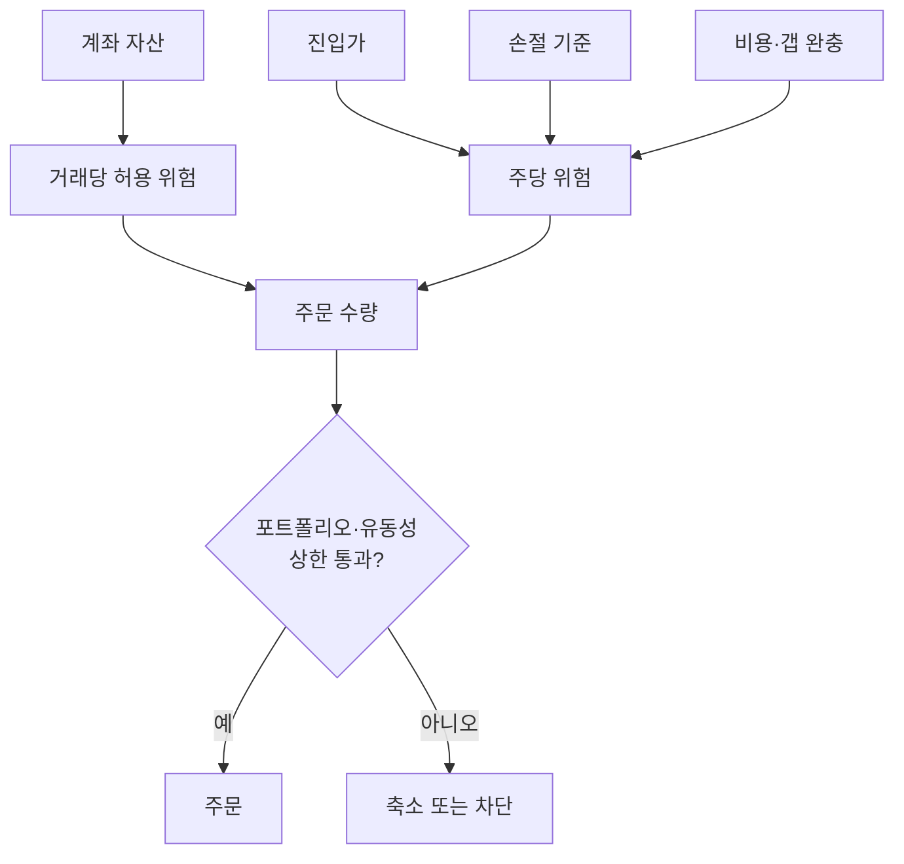
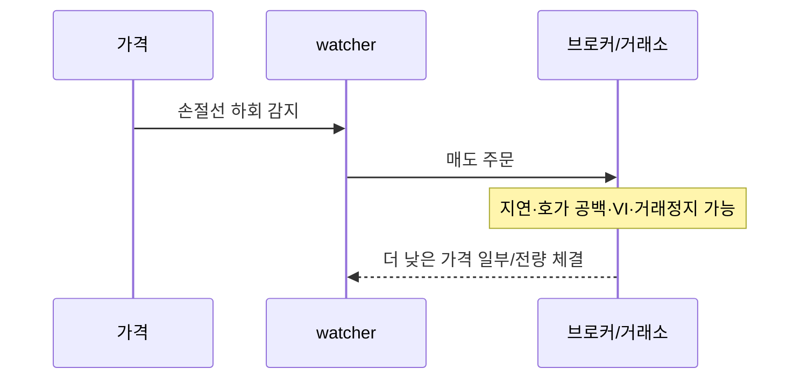
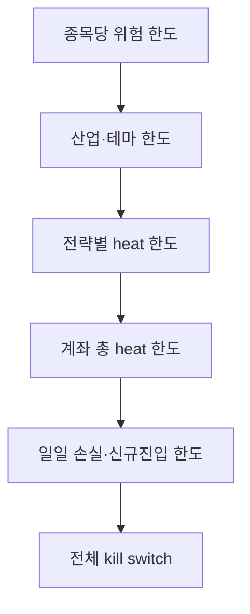
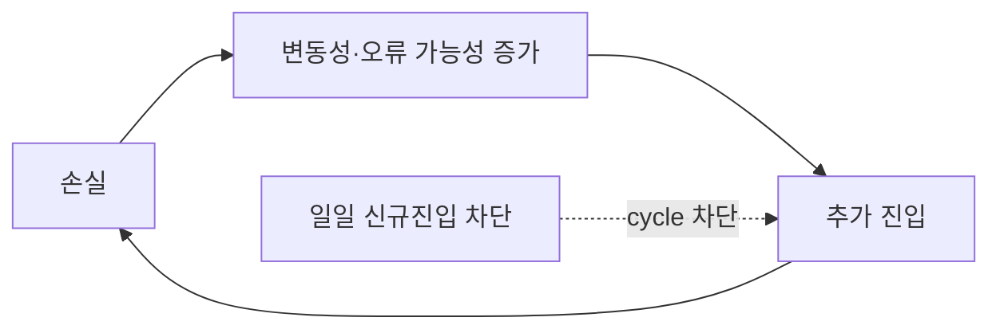

# 6. 리스크 관리·포지션 사이징

> 목표: “무엇을 살까”를 “틀렸을 때 얼마를 잃을까”로 변환한다.  
> 예상 시간: 25분

## 한 장 요약

- 손절은 손실 가격을 보장하지 않는다. 정상 체결 상황의 계획일 뿐이다.
- 포지션 크기는 확신이 아니라 **허용 손실과 손절 거리**에서 역산한다.
- 종목별 한도, 포트폴리오 heat, 일일 손실, 운영 kill switch를 계층적으로 둔다.
- Kelly 비율은 추정 오차에 매우 민감하므로 실전 베팅 비율이 아니라 이론적 상한으로 보는 편이 안전하다.

## 1. 거래당 위험으로 수량 계산하기

계좌자산을 $E$, 거래당 허용 손실률을 $r$, 진입가를 $P$, 손절 기준 가격을 $S$, 주당 비용·슬리피지 완충을 $C$라 하면:

$$
Qty=\left\lfloor\frac{E\times r}{|P-S|+C}\right\rfloor
$$

예시:

- 계좌: 5,000만 원
- 거래당 허용 위험: 0.5% = 25만 원
- 진입가: 50,000원
- 손절 기준: 48,500원
- 주당 비용·슬리피지 완충: 100원

주당 계획 위험은 1,600원이고 수량은 최대 `floor(250,000 / 1,600) = 156주`다. 주문금액 상한이나 거래량 참여율 상한이 더 작으면 그 수량으로 다시 줄인다.

### 핵심

손절 거리가 넓으면 수량이 작아져야 한다. 수량을 먼저 정하고 감당 가능한 손절가를 끼워 맞추면 시장 가설이 아니라 계좌 사정이 청산을 결정한다.

## 2. 손절의 네 종류

| 손절 | 무엇이 틀렸나 | 예시 |
|---|---|---|
| 가격 손절 | 허용 손실 범위를 넘음 | 진입 대비 -3% |
| 변동성 손절 | 정상 변동 범위를 이탈 | ATR의 2배 하회 |
| 시간 손절 | 기대한 시간 안에 실현되지 않음 | 당일 14:30까지 돌파 실패 |
| 가설 손절 | 진입 이유 자체가 사라짐 | breakout 재진입 실패, 공시 내용 반전 |

고정 퍼센트 손절은 단순하지만 종목별 변동성 차이를 무시한다. ATR 같은 변동성 기반 손절은 시장 상태에 적응하지만, 변동성이 급증하면 뒤늦게 너무 넓어질 수 있다. 어떤 방식을 쓰든 수량 계산과 함께 설계한다.

## 3. 손절가가 손실 상한이 아닌 이유

야간 악재, 급락, 하한가 매도 잔량, API 지연에서는 계획 손절보다 훨씬 크게 잃을 수 있다. 따라서 다음 두 위험을 나눈다.

- **planned risk**: 정상적인 체결에서 손절까지의 손실
- **stress loss**: 갭·유동성 고갈·동시 하락에서 가능한 손실

사이징은 planned risk로 계산하되, stress loss로 계좌 생존성을 별도 점검한다.

## 4. 포트폴리오 heat

각 포지션이 손절까지 갈 때의 계획 손실을 합한 값을 portfolio heat로 볼 수 있다.

$$
Heat=\frac{\sum_i Qty_i\times |Entry_i-Stop_i|}{Equity}
$$

단순 합은 모든 포지션이 동시에 손절되는 보수적 관점이다. 같은 산업·모멘텀 종목이 많을수록 실제로 동시 손절될 가능성이 높다.

계층형 한도의 예:

숫자는 계좌와 검증 결과에 맞춰 정해야 하며, 위 구조 자체가 중요하다.

## 5. Kelly criterion의 직관

이길 확률을 $p$, 질 확률을 $q=1-p$, 손실 1 대비 순이익 배수를 $b$라 하면 단순 이진 베팅의 Kelly 비율은:

$$
f^*=\frac{bp-q}{b}=p-\frac{q}{b}
$$

예를 들어 승률 40%, 이익 8, 손실 3이면 $b=8/3$이고 이론적 Kelly는 약 17.5%다. 이 숫자를 거래당 계좌 위험으로 그대로 쓰면 안 된다.

- $p$와 $b$는 과거의 불안정한 추정치다.
- 실제 손실은 이진적이지 않고 fat tail을 가진다.
- 거래들이 독립적이지 않고 동시에 실패한다.
- 비용과 시장충격이 크기에 따라 달라진다.

실무에서는 Kelly를 성장 최적화의 **상한 개념**으로 이해하고, fractional Kelly와 훨씬 작은 하드캡을 사용한다. 엣지 추정이 약하면 Kelly가 아니라 0에 가깝게 베팅하는 것이 논리적이다.

## 6. 일일 서킷브레이커

일일 손실 한도는 손실을 되돌리는 장치가 아니라 다음 악순환을 끊는 장치다.

좋은 breaker의 특성:

- 신규진입만 차단하고 기존 포지션의 위험 축소는 허용
- 프로세스 재시작 후에도 latch 유지
- 거래일이 확실할 때만 reset
- P&L 원천의 의미가 불명확하면 fail closed
- 차단 이유와 reset 예정일을 관측 가능하게 노출

[`src/services/daily_risk.py`](../../src/services/daily_risk.py)는 이 구조를 이미 상당 부분 반영한다. 특히 손실 임계값을 설정했더라도 `tdy_lspft`의 의미가 실계좌에서 검증되지 않았다면 임계값 비교를 신뢰하지 않고 신규진입을 차단한다. 데이터 의미론 자체를 리스크 불변조건으로 취급하는 설계다.

**라이브 상태 (2026-09-24)**: 손익 원천이 필요 없는 **신규 진입 건수 한도(3건/일)만 무장**돼 있다. 손실 한도 두 개는 `tdy_lspft` 실계좌 검증 전이라 꺼져 있다 — 켜면 검증 전까지 신규 매수가 전면 차단되는 설계이기 때문이다.

## 6-A. 현재 시스템에 대입하면 (2026-09-24 점검)

| 이 장의 원칙 | 라이브 시스템 | 판정 |
|---|---|---|
| 허용 손실 ÷ 주당 위험으로 수량 역산 | **예산 비율**(자산의 60%, TIER2는 30%)로 수량 결정. 손절 거리·변동성 무관 | 🟡 |
| 손절 종류 | 고정 가격 손절 -4%만. 변동성·시간·가설 손절 없음 | 🟡 |
| portfolio heat | 동시 보유 1종목이라 heat = 한 종목의 계획 손실(최대 약 2.4%) | 🟢 한도는 작음 |
| planned risk vs stress loss | 손절은 시장가로 즉시 실행. 갭 하락은 막지 못함(야간 보유 있음) | 🟡 |
| 엣지가 약하면 베팅을 0에 가깝게 | 실현 기준 Kelly **음수**인데 거래 지속 | 🔴 |

**Kelly를 실제 숫자로.** 5절 공식에 라이브 체결 5건(2승 3패, 평균 이익 +3.85%, 평균 손실 -3.02%)을 넣으면 `f* = 0.40 − 0.60/1.27 ≈ -0.07`로 음수다. 같은 승률이라도 설계 손익비(+8/-4, b=2)였다면 +0.10이었다. 손익비를 압축한 것은 agent의 조기 청산이다. 표본이 작아 추정 자체가 불안정하지만, 5절이 말한 "추정이 불확실할수록 0에 가깝게"의 방향은 분명하다.

**정수 주 문제.** 대형주는 1주 가격이 커서 예산 비율이 실제 비중을 결정하지 못한다. 청산된 5건의 실제 진입 비중은 자산의 13.3%~43.7%였다. 위험 기반 수량 공식도 결국 `floor`를 거치므로, 1주 가격이 허용 위험보다 큰 종목은 **아예 거래 불가**로 처리하는 편이 공식에 정직하다.

운영 결정(거래 지속)은 사용자의 리스크 자세 판단이며 이 문서가 바꾸지 않는다. 근거 숫자는 [9장 6·8절](09-system-theory-audit.md).

## 7. 리스크 예산을 잡는 순서

1. 감당 가능한 계좌 MDD와 중단 조건 정의
2. 동시에 실패할 포지션 수를 stress case로 가정
3. 계좌 총 heat 한도 결정
4. 산업·전략·종목별 하위 한도로 분해
5. 손절 거리와 유동성으로 수량 역산
6. paper/live 소액 체결 자료로 stress buffer 갱신
7. 성과가 아니라 추정 신뢰도와 용량이 개선될 때만 증액

## 8. 챕터 종료 체크

- [ ] 계좌 위험과 손절 거리로 수량을 계산할 수 있다.
- [ ] 손절가가 실제 최대 손실을 보장하지 않는 이유를 안다.
- [ ] 종목별 위험과 portfolio heat를 구분한다.
- [ ] Kelly 비율을 그대로 실거래에 쓰면 안 되는 이유를 설명할 수 있다.

## 참고자료

- [Kelly (1956) — A New Interpretation of Information Rate](https://onlinelibrary.wiley.com/doi/10.1002/j.1538-7305.1956.tb03809.x)
- [Investor.gov — What is Risk?](https://www.investor.gov/introduction-investing/investing-basics/what-risk)
- [Investor.gov — Diversification](https://www.investor.gov/introduction-investing/getting-started/asset-allocation)
