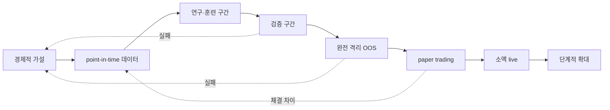
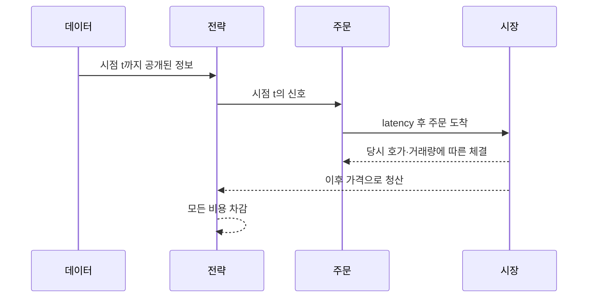
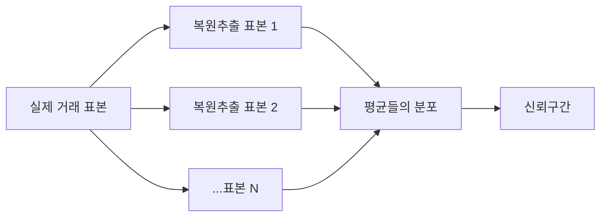
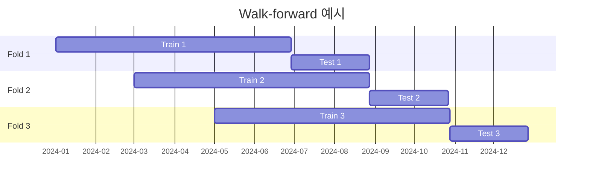

# 7. 백테스트·통계·과최적화

> 목표: 높은 수익률 그래프보다 신뢰할 수 있는 실험을 설계한다.  
> 예상 시간: 35분

## 한 장 요약

- 백테스트는 수익을 증명하는 도구가 아니라 잘못된 가설을 저렴하게 탈락시키는 도구다.
- 시간 순서, 당시 알 수 있었던 데이터, 체결 가능성, 비용을 재현해야 한다.
- 파라미터를 많이 시험할수록 최고 성과가 우연일 가능성이 커진다.
- 점 추정치보다 OOS, 대조군, 신뢰구간, 파라미터 안정성, paper/live 재현성을 함께 본다.



OOS를 본 뒤 규칙을 고치면 그 구간은 더 이상 OOS가 아니다. 다음 미사용 구간이 필요하다.

## 1. 올바른 시간 순서

각 거래는 다음 순서를 지켜야 한다.



종가를 보고 같은 종가에 매수하는 식의 불가능한 순서가 들어가면 look-ahead bias다. 재무 데이터도 결산일이 아니라 실제 공시일 이후에만 사용할 수 있다.

## 2. 자주 발생하는 편향

| 편향 | 어떻게 결과를 속이나 | 방지법 |
|---|---|---|
| look-ahead | 미래 고가·종가·공시를 미리 사용 | 데이터 availability timestamp 관리 |
| survivorship | 지금 살아남은 종목만 과거에도 보유 | 상장폐지 포함 point-in-time universe |
| selection | 좋은 기간·종목·결과만 보고 | 전체 탐색 이력과 실패 기록 |
| data snooping | 같은 데이터로 규칙을 반복 수정 | 격리 OOS, 다중검정 보정 |
| leakage | train과 test의 정보가 겹침 | 시간 분할, 필요 시 purge/embargo |
| corporate action | 분할·배당·합병으로 수익 왜곡 | 조정주가 정책과 이벤트 처리 |
| fill bias | 닿기만 하면 전량 체결 가정 | 호가·거래량·대기열 모델 |
| cost omission | 작은 gross edge를 수익처럼 표시 | 세금·수수료·spread·slippage 포함 |
| universe drift | 미래 시총/리더보드로 과거 선별 | 당시 구성 종목과 당시 순위 사용 |
| multiple testing | 수백 번 중 운 좋은 최고값 선택 | PBO, DSR, trial 수 기록 |

## 3. 점 추정치보다 분포

거래당 기대값이 `+0.2%`라는 숫자만으로는 부족하다. 표본 10개의 +0.2%와 표본 1,000개의 +0.2%는 신뢰도가 다르다.

Bootstrap은 관측 거래를 재표집해 기대값의 불확실성을 근사한다.



95% 구간이 0을 가로지르면 현재 표본으로는 양의 엣지를 명확히 구분하기 어렵다. 다만 거래를 독립 표본으로 재추출하는 단순 bootstrap은 같은 날·같은 종목군의 군집 손실을 과소평가할 수 있다. 자기상관이 있으면 날짜 단위 또는 block bootstrap도 검토한다.

## 4. 기준선과 대조군

전략이 상승장에서 벌었다면 진입 신호가 아니라 주식을 보유한 것 자체가 수익원일 수 있다.

좋은 대조군:

- 동일 기간 buy-and-hold 또는 시장 ETF
- 동일 종목·동일 보유시간·동일 청산의 무작위 진입
- 신호를 시간상 shuffle한 전략
- feature 하나를 제거한 ablation
- 비용과 체결은 같고 진입만 단순한 incumbent

```text
전략 알파 후보 = 전략 순기대값 - 조건을 맞춘 대조군 순기대값
```

대조군이 다른 거래 빈도와 비용을 가지면 공정한 비교가 아니다.

## 5. Walk-forward 검증

시계열은 무작위 k-fold보다 시간 순서를 보존해야 한다.



각 fold의 train에서만 파라미터를 선택하고, 바로 다음 test에는 고정해 적용한다. OOS 성과가 IS 성과보다 크게 무너지면 과최적화 또는 레짐 의존 가능성이 높다.

확인할 것:

- 각 fold 거래 수가 충분한가?
- 특정 fold 한 개가 전체 수익을 만들지 않는가?
- 선택된 파라미터가 매번 극단적으로 바뀌지 않는가?
- OOS 구간이 서로 겹쳐 거래를 중복 계산하지 않는가?

## 6. 파라미터 고원과 바늘구멍

좋은 파라미터는 정확히 한 점에서만 작동하기보다 주변에서도 비슷한 경향을 보이는 편이 신뢰하기 쉽다.

```text
안정적 고원                    과최적화 바늘

성과                            성과
  ^       ______                 ^          /\
  |     _/      \_               |         /  \
  |____/__________\___> 파라미터 |________/____\__> 파라미터
```

`손절 -2.9%`만 좋고 `-2.8%`, `-3.0%`가 모두 나쁘다면 경제적 현상보다 표본 잡음을 맞춘 것일 수 있다.

## 7. PBO와 Deflated Sharpe

### PBO: 선택 절차가 과최적화됐는가

CSCV 기반 Probability of Backtest Overfitting은 여러 전략/파라미터 중 IS 우승자가 OOS에서 하위권으로 떨어지는 빈도를 본다. 높을수록 “최고값 선택 과정”이 노이즈를 좇았다는 신호다.

### DSR: 많이 시험한 뒤 얻은 Sharpe인가

Deflated Sharpe Ratio는 다음을 고려해 관측 Sharpe의 신뢰를 낮춘다.

- 여러 번 시험하고 최고 결과만 선택한 편향
- 짧은 표본
- 수익률의 왜도와 첨도

중요한 입력은 **실제로 시도한 전체 trial 수**다. 실패한 실험을 기록하지 않으면 보정도 정직할 수 없다.

## 8. 체결 모델 stress test

기본 결과 하나 대신 가정을 흔든다.

| 스트레스 | 질문 |
|---|---|
| 비용 2배 | 작은 비용 오차에도 엣지가 남는가? |
| 1~2 tick 불리한 체결 | spread/slippage 후에도 남는가? |
| 주문 1 bar 지연 | 신호가 너무 빨리 소멸하지 않는가? |
| 부분체결 | 목표 포지션과 실제 포지션 차이를 견디는가? |
| gap-through stop | 계획 손실보다 큰 tail을 감당하는가? |
| 거래량 참여율 상한 | 실제 가능한 수량으로도 의미 있는가? |
| 상·하한가/거래정지 | 청산 불가능 상태를 처리하는가? |

가정이 조금만 불리해져도 수익이 사라지면 실거래 안전마진이 없다.

## 9. 현재 저장소의 검증 도구를 읽는 법

| 구현 | 답하는 질문 | 남는 한계 |
|---|---|---|
| [`backtest/engine.py`](../../backtest/engine.py) | 신호·손절·익절·보유기간의 점 추정 성과 | 일봉·고정비용·단순 체결 모델 |
| [`backtest/validate.py`](../../backtest/validate.py) walk-forward | 파라미터가 이후 구간으로 전이되는가 | 고정된 작은 유니버스와 레짐 범위 |
| `random_entry_null` | 진입 신호가 동일 청산의 무작위보다 나은가 | seed 수가 작으면 p-value가 거칠다 |
| [`backtest/statistics.py`](../../backtest/statistics.py) bootstrap | 기대값의 표본 불확실성은? | 거래 독립성 가정 |
| PBO/CSCV | 파라미터 선택 과정이 OOS에서도 유지되는가 | 공통 데이터 편향은 탐지 못함 |
| DSR | trial 선택과 비정규성을 감안해도 Sharpe가 특이한가 | trial 기록이 누락되면 과대평가 |
| [`backtest/ic.py`](../../backtest/ic.py) (`backtest.run ic`) | 피처에 횡단면 정보가 있나 · 구간별로 안정한가 · 비용 후 상위 N 바스켓이 남나 | 일봉 피처만. 로스터 생존편향 |
| [`automation/signal_efficacy.py`](../../automation/signal_efficacy.py) | **라이브 점수**가 같은 날 같은 유니버스보다 나은 종목을 고르나 | 저널에 점수 합계만 있어 항목별 분해 불가 |

현재 엔진은 신호 다음 날 시가 진입, 같은 일봉에 손절·익절이 모두 닿으면 손절 우선이라는 보수적 규칙을 둔다. 그러나 live 전략은 장중 호가·리더보드·레짐을 사용한다. 따라서 일봉 백테스트는 **전략 아이디어의 방향성 검증**이고, 실제 장중 신호·주문 경로 전체의 재현 실험은 아니다.

### 2026-09-24 점검 결과

| 검증 | 결과 |
|---|---|
| 부트스트랩 (below_ma, 거래당) | +0.002%, CI [-0.254, +0.263] — 0과 구분 불가 |
| 무작위 진입 대조군 | 무작위가 35% 확률로 이김 — 진입 신호 기여 없음 |
| Deflated Sharpe (n_trials=40) | 0.087 — 다중검정 후 무의미 |
| walk-forward (창 6개) | 4개가 결합 OOS 0 이하 |
| **라이브 신호 대조군** (저널, 26세션) | 점수-미래수익 상관 -0.014 |
| rank IC (현행 피처 `ma20_dip`) | 세 구간 모두 \|t\|<1.3 |

**라이브 표본에 대한 오해 하나를 바로잡는다.** 원래 계획은 "백테스트가 재현 못 하는 라이브 신호의 가치는 체결 100건+로만 검증된다"였고, 진입 속도(0.22건/일)로는 약 2년이 걸렸다. 그런데 검증 대상은 **체결이 아니라 신호**다. 후보 저널이 120초마다 라이브 점수를 기록하므로 신호 303건의 전진수익률을 바로 잴 수 있었다. 표본이 부족하다고 느껴지면 이미 기록 중인 것부터 센다.

**세 가지 방법론 교훈**

1. **당일 평균 제거 + 세션 단위 블록 부트스트랩.** 같은 날 30종목은 시장 요인을 공유한다. 신호 단위로 풀링하면 CI가 몇 배 좁아진다(3절의 "군집 손실 과소평가" 경고가 실제로 결론을 바꾸는 크기였다).
2. **3등분 안정성.** 저변동성 피처는 10일 기준 전체 t 5.17로 좋아 보였지만 최근 3분의 1에서 t 0.41이었다(1일 기준도 0.20). 6절의 파라미터 고원 논리를 시간축에도 적용한다.
3. **trial 수는 계속 누적된다.** 파라미터 튜닝 40회에 이어 피처 스윕 16~56셀이 추가됐다. 다음 DSR·PBO 계산은 이 전체를 trial로 신고해야 정직하다.

⚠️ 백테스트 슬리피지 가정(`slippage_bps`)의 기본값은 0이다. 8절의 비용 스트레스를 하려면 `--slippage-bps 5`, `10`으로 명시해야 한다.

2026-08-18부터 라이브 유니버스가 백테스트와 **같은 로스터**다. 그 전에는 백테스트가 라이브가 실행한 적 없는 유니버스(로스터)를, 라이브는 리더보드를 봤다 — 2절 표의 `universe drift`가 코드 두 곳에 걸쳐 있던 사례다.

## 10. 전략 승인 evidence pack

최소한 다음 결과를 한 번에 보관한다.

```yaml
strategy_version: "git SHA + config hash"
data_version: "수집 시각, 종목 universe, corporate-action 정책"
trials_attempted: 0
is_summary: {}
oos_summary: {}
regime_breakdown: {}
random_entry_null: {}
bootstrap_ci: {}
pbo: {}
dsr: {}
cost_stress: {}
fill_assumptions: {}
known_limitations: []
approval_decision: "reject | paper | small_live | scale"
```

## 11. 챕터 종료 체크

- [ ] OOS를 본 뒤 수정하면 더 이상 OOS가 아님을 이해한다.
- [ ] survivorship, look-ahead, fill bias를 설명할 수 있다.
- [ ] 무작위 진입 대조군이 필요한 이유를 안다.
- [ ] PBO와 DSR이 각각 무엇을 보정하는지 구분한다.
- [ ] 일봉 백테스트와 장중 실거래 사이의 모델 차이를 안다.

## 참고자료

- [Bailey et al. — The Probability of Backtest Overfitting](https://scholarworks.wmich.edu/math_pubs/42/)
- [Bailey & López de Prado — The Deflated Sharpe Ratio](https://papers.ssrn.com/sol3/papers.cfm?abstract_id=2460551)
- [Pseudo-Mathematics and Financial Charlatanism](https://papers.ssrn.com/sol3/papers.cfm?abstract_id=2308659)

