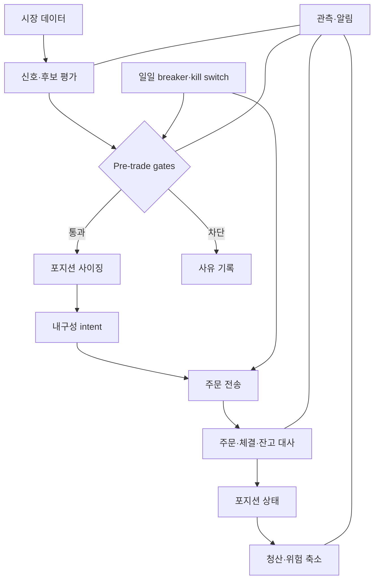
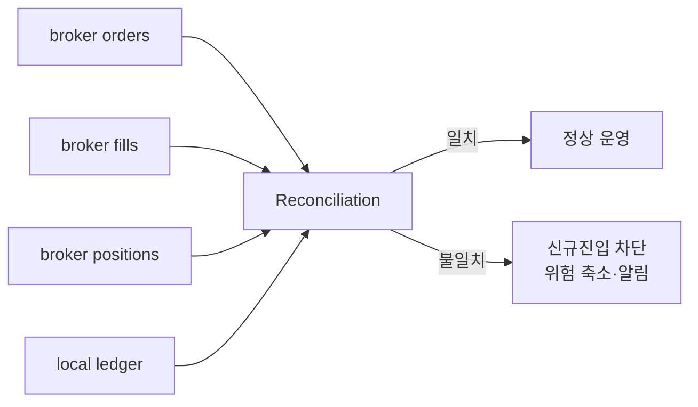
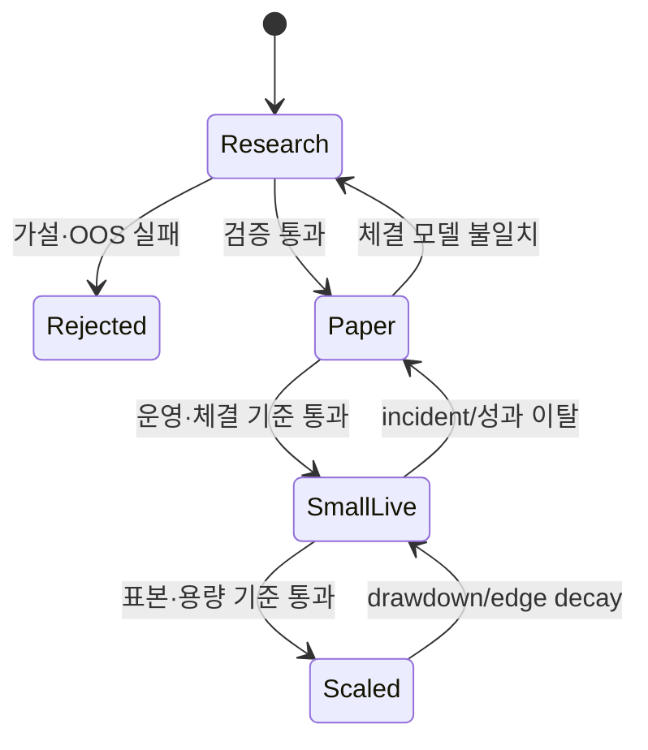
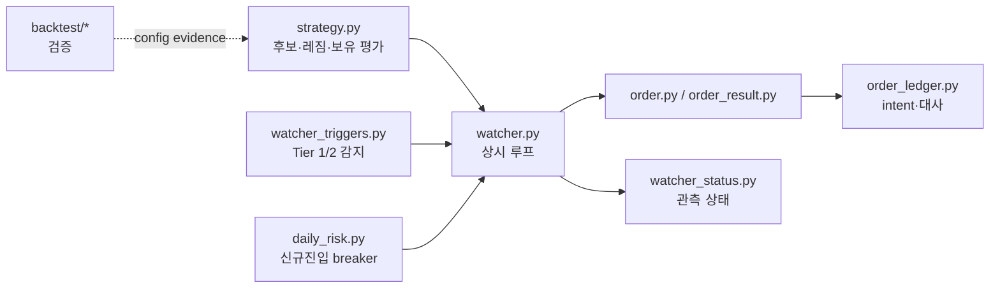

# 8. 실전 자동매매 승인 체크리스트

> 목표: 투자 이론을 코드의 불변조건, 승인 게이트, 운영 절차로 바꾼다.  
> 예상 시간: 20분

## 한 장 요약

- 전략 판단은 확률적이어도 리스크 불변조건은 결정론적이어야 한다.
- 신호, 주문 intent, 접수, 체결, 잔고를 서로 다른 상태로 관리한다.
- 실거래 승인은 `백테스트 통과`가 아니라 연구 → paper → 소액 live → 확대의 단계다.
- 장애 때 새 포지션을 만들지 않는 fail-closed와 기존 위험을 줄이는 청산 가능성을 함께 보장한다.

## 1. 전체 제어 구조



## 2. 무엇을 코드로 강제할까

| 결정 | 코드 불변조건 | 모델/사람의 판단 가능 영역 |
|---|---|---|
| 장이 열렸는가 | 공식 캘린더·시간·세션 확인 | 특수장 해석 검토 |
| 데이터가 신선한가 | timestamp/sequence 임계값 | 뉴스 맥락 해석 |
| 중복 주문인가 | idempotency key·ledger 조회 | 없음 |
| 한도를 넘는가 | 종목·산업·계좌 하드캡 | 한도 축소 제안 |
| 일일 breaker가 걸렸나 | durable latch | 재개는 명시적 정책 |
| 손절선 도달 | 결정론적 Tier 1 | 예외 없이 위험 축소 우선 |
| 후보의 질 | 점수·모델·agent 의견 | 정성 정보와 불확실성 |
| unknown 주문 | 조회·대사 전 재전송 금지 | 운영자 escalation |

LLM이나 외부 agent가 종목을 평가할 수는 있어도, 손실 한도·중복 방지·주문 상태 전이는 프롬프트 준수에 의존시키지 않는다.

## 3. Pre-trade gate

신규 매수 직전에 모두 확인한다.

### 시장과 데이터

- [ ] 오늘이 지원되는 KRX 거래일이고 현재 세션이 주문을 허용한다.
- [ ] 시세·호가·계좌 snapshot이 freshness 한도 안이다.
- [ ] 가격 단위, 상·하한가, 주문 유형이 현재 규정과 API 계약에 맞다.
- [ ] 거래정지, VI, 관리/주의 상태 등 거래 불능 조건을 확인했다.

### 계좌와 포트폴리오

- [ ] 주문 가능 현금과 이미 제출된 미체결 매수 자금을 함께 계산했다.
- [ ] 같은 종목의 보유·미체결·unknown 주문을 확인했다.
- [ ] 종목·산업·전략·계좌 gross exposure와 heat 한도를 통과했다.
- [ ] 일일 신규진입 수와 손실 breaker가 열려 있다.

### 주문과 유동성

- [ ] 허용 손실과 손절 거리로 수량을 계산했다.
- [ ] 주문금액이 호가 깊이·최근 거래대금의 허용 참여율 이하다.
- [ ] 예상 spread/slippage 후에도 기대값이 남는다.
- [ ] intent와 idempotency key를 주문 전 기록했다.

## 4. 체결 후 불변조건



- 부분체결 수량만 실제 포지션으로 반영한다.
- 평균 체결가를 arrival price와 비교해 슬리피지를 기록한다.
- 취소 요청과 취소 완료를 구분한다.
- 로컬 원장과 브로커가 다르면 브로커를 사실 원천으로 대사하되 원인을 보존한다.
- unknown 상태가 해소되기 전 같은 경제적 주문을 재전송하지 않는다.

## 5. 장애별 기본 행동

| 장애 | 신규진입 | 기존 포지션 | 알림·복구 |
|---|---|---|---|
| 시세 stale | 차단 | 마지막 값으로 무리한 판단 금지 | feed 상태 확인 |
| 계좌 조회 실패 | 차단 | 위험 축소 경로 우선 확보 | 재조회·수동 확인 |
| 주문 timeout | 중복 주문 차단 | 주문/체결/잔고 대사 | unknown 상태 노출 |
| ledger 쓰기 실패 | 차단 | 브로커 조회로 실상 확인 | durable storage 복구 |
| agent 응답 실패 | 정성 진입 보류 | 코드 기반 Tier 1 유지 | fallback/alert |
| 손실 한도 도달 | 신규매수 latch | 청산은 허용 | 다음 확정 거래일까지 유지 |
| 캘린더 불확실 | 차단 | 보유 위험 모니터링 | 공식 일정 확인 |

`fail closed`가 모든 API를 멈춘다는 뜻은 아니다. 위험을 늘리는 동작은 막고, 조회·취소·청산처럼 위험을 줄이는 동작은 가능한 한 유지한다.

## 6. 관측해야 할 지표

### 전략 지표

- strategy ID / config hash별 거래 수와 비용 후 기대값
- 모멘텀·평균회귀 및 레짐별 손익
- 예상 수익과 실제 수익의 차이
- 신호 발생 → 주문 → 첫 체결까지 latency

### 실행 지표

- 주문 접수율, 거절률, unknown 비율
- fill ratio와 partial-fill 비율
- arrival price 대비 implementation shortfall
- spread, 주문 크기/호가 깊이, 취소 소요시간

### 리스크·운영 지표

- 종목/산업/전략별 exposure와 portfolio heat
- intraday drawdown, daily breaker 상태
- 데이터 age, loop heartbeat, 대사 불일치
- 수동 개입, kill switch, 재시작 이력

수익률만 모니터링하면 시스템이 망가진 뒤에야 알 수 있다. 실행 품질과 데이터 품질은 손익의 선행 지표다.

## 7. 단계별 실거래 승인 게이트



### Research → Paper

- [ ] 경제적 가설과 실패 조건이 문서화됐다.
- [ ] point-in-time 데이터와 비용 모델을 사용했다.
- [ ] OOS 기대값, 신뢰구간, MDD, turnover를 함께 확인했다.
- [ ] matched random-entry보다 우위가 있다.
- [ ] 다중 trial을 기록하고 PBO/DSR을 확인했다.
- [ ] 파라미터가 한 점이 아니라 주변 범위에서도 안정적이다.

### Paper → Small live

- [ ] 실제 세션의 주문 타입, 부분체결, 취소, timeout 경로를 시험했다.
- [ ] paper 체결과 보수적 체결 모델의 차이를 측정했다.
- [ ] 모든 하드캡, breaker, kill switch, 재시작 대사를 시험했다.
- [ ] 알림과 운영 runbook이 실제 대응 가능한 정보를 준다.

### Small live → Scale

- [ ] 비용 후 성과가 사전에 정한 허용 범위 안이다.
- [ ] 백테스트 대비 슬리피지와 fill ratio가 설명 가능하다.
- [ ] 특정 종목·날짜·레짐에 수익이 과도하게 집중되지 않았다.
- [ ] 주문 크기 증가에 따른 시장충격을 반영했다.
- [ ] 증액 단위와 자동 축소 조건이 미리 정해져 있다.

## 8. 현재 저장소에 대입한 코드 지도



이론적으로 특히 유지해야 할 경계:

- Tier 1 손절·익절·중복 방지·한도는 결정론적 코드 경로
- Tier 2 후보·레짐·정성 판단은 실패해도 Tier 1을 막지 않는 경로
- 계좌 손익 필드의 의미가 검증되지 않으면 추측하지 않고 신규진입 차단
- timeout/unknown을 실패로 단정하지 않고 ledger와 브로커 대사
- 백테스트 결과와 live 설정을 config hash로 연결

### 2026-09-24 점검: 게이트별 현재 위치

| 게이트 | 이 시스템 | 판정 |
|---|---|---|
| Pre-trade: 거래일·세션 | KRX 캘린더, 미지원 연도·특별장은 신규 매수만 차단 | 🟢 |
| Pre-trade: 중복 주문 | 영속 intent 원장 + 매수 직전 브로커 미체결·체결 대사 | 🟢 |
| Pre-trade: 일일 breaker | 건수 한도 3 무장, 손실 한도 off | 🟡 |
| Pre-trade: 허용 손실로 수량 계산 | 예산 비율 방식 | 🟡 |
| Pre-trade: **비용 후 기대값이 남는다** | 확인하는 게이트 없음. 측정상 음수 | 🔴 |
| 체결 후 대사 | 폴링(진실원천) + 실시간 체결 통보 | 🟢 |
| 장애 시 fail-closed 방향 | 신규 매수만 차단, 보호매도·손절·취소 유지 | 🟢 |
| 결정론/확률 분리 | 손절·한도·중복방지는 코드, LLM은 Tier 2 판단 | 🟢 |
| 설정 드리프트 | watcher가 실효 config를 `/state`로 공개, MCP 전략 툴이 그 값을 기본값으로 사용(2026-09-24~) | 🟢 |
| **Research → Paper** | 무작위 대조군·DSR·라이브 신호 검증 모두 실패 | 🔴 |

7절 상태 기계로 보면 이 전략의 이론상 위치는 **Research(또는 Rejected)**이고, 실제 운영은 **Small live**다. 이 차이는 결함이 아니라 사용자가 알고 선택한 리스크 자세다(2026-09-08 진입 재개, 2026-09-24 유지). 이 표는 그 결정의 근거를 숫자로 남긴다.

한 가지 추가 교훈: **LLM에게 주는 도구의 기본값도 불변조건이다.** MCP 전략 툴의 기본값이 폐기된 모멘텀·리더보드 설정이라, agent가 인자 없이 호출하면 라이브가 절대 사지 않는 KOSDAQ 급등주를 점수 13으로 받았다(라이브 게이트는 8). docstring에 "배포값을 넘기세요"라고 경고했지만 호출자는 따르지 않았다. 2절의 원칙대로 프롬프트 준수에 의존하지 않고, 기본값을 배포값에서 해석하도록 코드로 강제했다. 상세는 [9장](09-system-theory-audit.md).

## 9. 매일 3분 체크리스트

### 장 전

- [ ] 거래일·특수 세션·배포 버전·config hash
- [ ] breaker/ledger/시세 feed/계좌 조회 정상
- [ ] 미해결 unknown 주문과 전일 carryover 없음
- [ ] 당일 실적·공시·시장 이벤트 위험 확인

### 장 중

- [ ] 데이터 age와 watcher heartbeat
- [ ] 실제 exposure/heat와 미체결 자금
- [ ] partial/unknown/거절 주문
- [ ] 슬리피지 급증과 레짐 전환

### 장 후

- [ ] 주문·체결·잔고 완전 대사
- [ ] gross P&L → 비용 → net P&L 분해
- [ ] 전략/레짐/실행 품질별 일지
- [ ] 예외는 파라미터를 즉시 수정하지 말고 가설과 evidence로 축적

## 10. 최종 원칙

```text
확률적인 것: 어떤 종목이 오를지, 어떤 전략이 내일 잘될지
결정론적이어야 하는 것: 얼마까지 살지, 언제 차단할지, 주문이 실제 체결됐는지
```

자동화의 목적은 판단 횟수를 늘리는 것이 아니라, 좋은 판단을 일관되게 실행하고 나쁜 결과의 전파 범위를 제한하는 것이다.

## 참고자료

- [KRX — Guide to Trading in the Korean Stock Market](https://global.krx.co.kr/contents/GLB/01/0109/0109000000/guide_to_trading_in_the_korean_stock_market.pdf)
- [SEC Investor Bulletin — Trading Basics](https://www.sec.gov/file/trading101basicspdf)
- [Bailey et al. — Probability of Backtest Overfitting](https://scholarworks.wmich.edu/math_pubs/42/)

