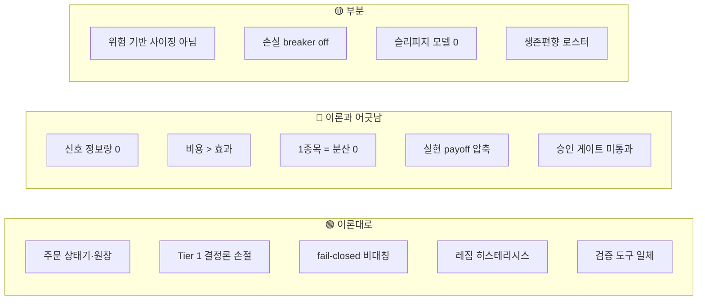
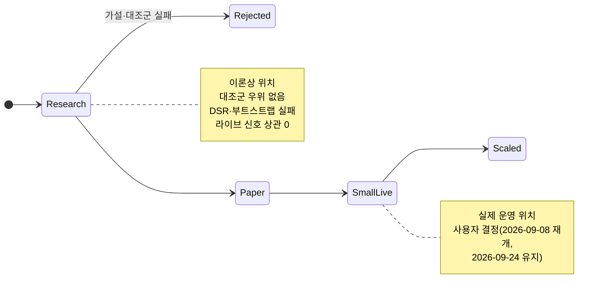

# 9. 현재 시스템 이론 점검 (2026-09-24)

> 목표: 0~8장의 이론을 **지금 돌고 있는 실거래 시스템**에 대조해, 어디가 이론대로 서 있고 어디가 이론과 어긋나는지 증거와 함께 본다.  
> 기준: 배포 digest `sha256:a78ffa3a…`(tag `signal-efficacy-d7273d6`), 라이브 설정은 watcher `/state`의 실효 config에서 확인  
> 예상 시간: 20분

## 한 장 요약

- **엔지니어링 불변조건(3·8장)은 이론대로다.** 주문 intent 원장, unknown 재전송 금지, 결정론적 Tier 1 손절, fail-closed 비대칭, 레짐 히스테리시스까지 구현돼 있다.
- **전략 가설(0·4장)은 증거로 기각됐다.** 라이브 점수는 종목을 서열화하지 못한다 — `corr(score, 당일 평균 제거 5일 수익률) = -0.014`(n=320).
- **엣지가 있어도 수확할 구조가 아니다(5·6장).** 비용 0.23%와 1종목 포트폴리오가 작은 횡단면 효과를 전부 삼킨다. 병목은 점수 공식이 아니다.
- **실현 손익비가 설계 손익비와 다르다(1장).** `-4%/+8%`로 설계했지만 agent 조기 청산 때문에 실현은 `-3.02%/+3.85%`였고, 그 조합의 Kelly 비율은 음수다.
- **승인 게이트(8장) 기준으로는 Research 단계**인데 Small live로 운영 중이다. 사용자가 리스크 자세로 선택한 상태이며, 이 장은 그 결정의 근거를 숫자로 남긴다.

## 1. 점검 방법

이 장의 모든 숫자는 재현 가능한 출처가 있다. 기억이나 코드 기본값이 아니라 **배포값과 실측**만 쓴다.

| 질문 | 출처 | 재현 |
|---|---|---|
| 라이브 설정이 무엇인가 | watcher `/state`의 `config` | MCP HTTP 서버의 `/api/agent_overview` |
| 라이브 신호에 정보가 있나 | 후보 점수 저널 4,774 스냅샷 | `python automation/signal_efficacy.py` (인클러스터) |
| 어떤 입력에 정보가 있나 | 로스터 30종목 × 600세션 일봉 + 수급 100일 | `python -m backtest.run ic` |
| 지수 대비 성과·투자비중 | kt00002 총자산·예수금 + ka20006 KOSPI | `/api/dashboard`의 `benchmark` |
| 실현 거래 | 원장 `order_intents` + `live_trades.jsonl` | `live_trade_journal.py --stats` |

라이브 설정 요약(2026-09-24 실측): `entry_mode=below_ma`(MA20), `universe_mode=roster`(KOSPI 대형주 30), 시총 ≥3조, 점수 게이트 8, `max_positions=1`, `position_budget_pct=60`(TIER2는 절반), 손절 `-4%` / 익절 `+8%`, 진입 건수 한도 3/일, 손실 한도 off.

## 2. 장별 점검표

| 장 | 이론의 요구 | 시스템의 실제 | 판정 |
|---|---|---|---|
| 0 | 수익을 베타·팩터·알파·운으로 분해 | 벤치마크가 α를 **현금 대기 / 종목 선택**으로 분해(9/24~) | 🟢 |
| 0 | 가설·무효화 조건을 명세 | `below_ma` 가설은 있으나 무효화 조건(추세장)이 코드에 없음 | 🟡 |
| 1 | 비용 후 기대값이 양수 | 라이브 n=5 거래당 **-0.27%**, 점수 상관 0 | 🔴 |
| 1 | 설계 손익비 = 실현 손익비 | 설계 1:2, 실현 1:1.27 | 🔴 |
| 2 | 펀더멘털은 신호보다 필터 | 시총 3조·로스터로 유니버스 필터만 사용 | 🟢 |
| 3 | 비용·체결·주문 상태 모델 | 비용 0.23% 반영, intent 원장·대사·unknown 처리 | 🟢 |
| 3 | 슬리피지 반영 | 백테스트 `slippage_bps` 기본 0 | 🟡 |
| 4 | 반대 가설을 한 점수에 섞지 않기 | 평균회귀 점수 안에 당일 상승(모멘텀) 가점 | 🔴 |
| 4 | 중복·상수 항목 제거 | 레짐·스프레드 항목이 종목 간 상수 | 🔴 |
| 5 | 공통 위험의 분산 | 동시 보유 1종목 | 🔴 |
| 5 | 레짐 경계 flip 방지 | 탈출 임계·10틱 debounce | 🟢 |
| 5 | 레짐별 성과 검증 | 26세션이라 분할 불가 | 🟡 |
| 6 | 허용 손실로 수량 역산 | 예산 %로 수량 결정, 손절 거리 무관 | 🟡 |
| 6 | 계층형 한도·breaker | 건수 한도 3 무장, 손실 한도 off(`tdy_lspft` 미검증) | 🟡 |
| 6 | 엣지 약하면 베팅 → 0 | 실현 기준 Kelly **음수**인데 거래 지속 | 🔴 |
| 7 | OOS·대조군·다중검정 | walk-forward·무작위 대조군·PBO·DSR·IC 하네스 | 🟢 |
| 7 | 생존편향 없는 유니버스 | 오늘의 대형주로 고른 고정 로스터 | 🟡 |
| 8 | Research → Paper 게이트 통과 후 live | 게이트 미통과 상태로 Small live | 🔴 |
| 8 | 확률 판단과 결정론 불변조건 분리 | LLM은 Tier 2만, 한도·손절·중복방지는 코드 | 🟢 |

아래 절은 🔴와 🟡 중 결론을 바꾸는 항목만 자세히 본다.

## 3. 신호: 점수가 서열화를 못 한다 (0·4장)

### 측정

4장의 엣지 정의는 `E[R | X] − E[R_baseline] − 비용`이다. 라이브 점수 `X`를 같은 날 같은 유니버스의 나머지 종목(baseline)과 비교했다.

| 검증 (2026-08-19~09-23, 26세션, 신호 303건) | 결과 |
|---|---|
| corr(score, 당일 평균 제거 5일 수익률) | **-0.014** (n=320) |
| 5일 세션당 초과 (신호 − 나머지) | **-1.02%p**, 95% CI [-2.49, +0.28], P(신호 우위) 0.07 |
| 10일 세션당 초과 | **-1.85%p**, 95% CI [-4.27, +0.45], P(신호 우위) 0.06 |
| 점수 버킷 5일 초과 | 6점 -1.18% / 7점 +0.77% / 8점 -0.10% / 9점 -0.07% |

두 보정이 결론을 만든다. **당일 평균 제거**는 시장 전체의 움직임(베타)을 빼서 선택분만 남기고, **세션 단위 블록 부트스트랩**은 같은 날의 상관된 종목들을 독립 표본으로 세지 않는다(7장 3절의 경고). 둘을 빼면 표본 303건이 정밀도를 부풀린다.

확정된 것은 **상관 0**이다. "대조군보다 못하다"는 CI가 0을 걸치므로 P≈0.93 수준의 시사이지 확정이 아니다.

### 원인: 점수 구조

`below_ma` 모드에서 로스터 종목이 받는 점수를 항목별로 분해하면 이유가 보인다(`src/services/strategy.py::_score_candidate`).

| 항목 | 점수 | 종목 간 변별력 | 이론 판정 |
|---|---|---|---|
| 레짐 | risk_on +2 / 그 외 +1 | **없음** — 그날 모든 종목에 동일 | 선택이 아니라 타이밍. 게이트를 넘는 종목 **수**만 바꾼다 |
| 출처 | 로스터 0, 로스터+carryover +1 | 약함 | 직전 후보였는지(지속성) |
| MA20 이격 | 0~2% +3 / 2~5% +2 | 핵심 항목 | 일봉 IC ≈ 0 (아래 4절) |
| 시가 위 | +1 | 있음 | **모멘텀 항목** — 평균회귀 점수에 반대 가설 혼입 |
| 호가 잔량비 | ≥1.5 +2 / ≥1.2 +1 | 순간값 | 저널에 성분이 없어 측정 불가 |
| 스프레드 ≤0.35% | +1 | **거의 없음** — 대형주는 대부분 충족 | 상수 |

이론상 최대 10점이고 실측 분포도 2~10점(중앙값 6~8)이다. 상수 항목을 빼면 변별하는 것은 MA 이격, 시가 대비 위치, 호가 잔량비 세 개뿐이고, 그중 MA 이격 자체에 정보가 없다.

4장 5절이 경고한 두 가지가 동시에 있다.

- **종목 간 상수인 항목은 서열 정보가 0이다.** 레짐 +2는 "오늘 모든 종목 +2"라서 순위를 바꾸지 못하고 게이트 통과 여부만 바꾼다. 타이밍 변수를 선택 점수에 넣으면 두 기능이 한 숫자에 섞인다.
- **반대 가설의 혼합.** 평균회귀는 "떨어진 것이 돌아온다", 시가 위 가점은 "오늘 오르는 것이 계속 오른다"다. 한 점수에서 서로를 상쇄할 수 있다.

## 4. 입력 탐색: 무엇에 정보가 있나 (4·7장)

점수를 다시 만들기 전에 **넣을 재료에 정보가 있는지**를 먼저 쟀다. 세션별로 로스터를 피처 순위와 미래 수익 순위로 각각 줄 세워 Spearman 상관(rank IC)을 구하고, 샘플을 시간순 3등분해 안정성을 봤다.

| 피처 | 1일 IC | t | 3등분 t | 판정 |
|---|---|---|---|---|
| `ma20_dip` (**현행 신호**) | +0.017 | 1.47 | +1.06 / +1.21 / +0.40 | 🔴 정보 없음 |
| `rev_1d` (전일 하락 → 반등) | **+0.057** | **5.24** | **+3.06 / +2.89 / +3.10** | 🟢 세 구간 모두 안정 |
| `low_vol_20d` (저변동성) | +0.023 | 1.88 | +1.10 / +2.29 / **+0.20** | 🟡 최근 구간에서 소멸 |
| `mom_20d` (20일 모멘텀) | -0.006 | -0.49 | 전부 \|t\|<1.2 | 🔴 없음 |
| 수급 1~20일 (외국인·기관·연기금) | — | 전부 문턱 미달 | 표본 61~99세션 | 🔴 판단 불가 |

`rev_1d`는 학술적으로 잘 알려진 **단기 반전(short-term reversal)** 효과와 일치한다(Jegadeesh 1990, Lehmann 1990). `low_vol_20d`는 **저변동성 이상현상**과 같은 방향이지만 최근 3분의 1에서 사라졌다 — 전체 표본 t 하나만 봤으면 놓쳤을 것이다(7장 6절의 파라미터 고원과 같은 논리를 시간축에 적용).

⚠️ 다중검정: 16~56셀을 검정하면 귀무가설만으로도 최대 |t|가 2.4~2.8쯤 나온다. `backtest.run ic`는 이 문턱을 결과 옆에 함께 출력한다(7장 7절의 DSR과 같은 보정).

⚠️ 로스터는 **오늘의 대형주**로 고른 고정 목록이라 생존편향이 있다(7장 2절). 결과는 이 고정 집단 안의 상대적 서술로만 읽는다.

## 5. 수확 가능성: 병목은 점수가 아니다 (1·3·5장)

정보가 있는 `rev_1d`조차 실행하면 비용에 먹힌다. 상위 N종목 바스켓, 1일 보유, 같은 날 등가중 유니버스 대비 초과수익이다.

| 상위 N | 초과/일 | t | 비용 0.23% 차감 |
|---|---|---|---|
| **1** (라이브가 드는 수) | **-0.018%** | **-0.13** | -0.248% |
| 3 | +0.114% | 1.39 | -0.116% |
| 10 | +0.094% | 2.35 | -0.136% |
| 15 | +0.079% | 2.80 | -0.151% |

두 가지 이론이 이 표를 설명한다.

**① 적극적 운용의 기본 법칙 (Grinold).** 정보비율은 대략 `IR ≈ IC × √(독립적 베팅 수)`다. IC 0.057은 작은 값이라 **여러 종목에 넓게 걸어야** 신호가 잡음 위로 올라온다. 표에서 t가 바스켓을 넓힐수록 커지는 것(1.39 → 2.80)이 그 현상이고, 가장 극단의 1종목만 사면 신호가 잡음에 묻힌다(t -0.13). `max_positions=1`은 이 법칙의 정반대다.

**② 비용은 회전율에 곱해진다 (3장 5절).** 매일 회전하면 매일 0.23%를 낸다. 어느 폭에서도 초과수익(0.08~0.11%)이 통행료를 넘지 못한다.

즉 점수를 다시 만들면 위 표의 **첫 열만** 바뀐다. 결과를 바꾸는 레버는 점수 바깥에 있다.

| 레버 | 이론적 효과 | 이 계좌의 제약 |
|---|---|---|
| 회전 낮추기 | 비용을 보유기간으로 나눈다 | 장기 구간에 남은 피처(저변동성)는 최근 소멸. 보유를 늘리면 좋아 보이는 건 강세장 베타(7장 4절) |
| 분산 늘리기 | `√N`으로 IR 개선 | 자산 약 124만 원. 5종목이면 종목당 약 25만 원이라 로스터 30개 중 **15개만** 1주라도 살 수 있다 |
| 비용 낮추기 | 통행료 자체를 줄인다 | 거래세가 왕복 비용의 **87%**(0.20/0.23). 국내 상장 ETF 매도는 증권거래세가 **면제**된다(아래) |

### 세제 확인 (2026-09-24)

- **코스피 주식**: 2026-01-01부터 증권거래세 0.05% + 농어촌특별세 0.15% = **매도 시 0.20%**. 수수료 0.015%×2를 더해 왕복 0.23%가 이 저장소의 비용 가정과 일치한다.
- **국내 상장 ETF**: 세법상 신탁형 집합투자기구라 **매도 시 증권거래세가 없다**. 매매차익 과세는 ETF 유형에 따라 다르므로(국내 주식형 여부) 상품별로 확인한다. 거래세가 빠지면 왕복 비용은 수수료 수준(약 0.03%)과 스프레드로 내려가고, 위 표 top-10은 **-0.136% → +0.064%/일**로 부호가 바뀐다.

⚠️ 이 계산은 ETF가 개별 종목과 같은 횡단면 효과를 가진다는 뜻이 **아니다.** ETF는 종목 바스켓이라 `rev_1d` 같은 개별 종목 효과가 그대로 옮겨가지 않는다. 말할 수 있는 것은 "비용 구조가 달라서 같은 크기의 효과라면 수확 가능해진다"까지다. ETF용 신호는 별도 가설과 검증이 필요하다.

## 6. 손익비와 사이징 (1·6장)

### 설계와 실현의 차이

손절·익절을 `-4% / +8%`로 설계하면 1장 3절의 손익분기 승률은 비용 포함 `(4+0.23)/(8+4) ≈ 35%`다. 하지만 라이브 청산의 대부분은 Tier 1 규칙이 아니라 agent의 판단(Tier 2)이었다.

| | 평균 이익 | 평균 손실 | 손익비 | 손익분기 승률 |
|---|---|---|---|---|
| 설계 (`-4 / +8`) | +8% | -4% | 1 : 2 | 약 35% |
| 실현 (n=5, 순손익) | **+3.85%** | **-3.02%** | 1 : 1.27 | **약 44%** |
| 실현 승률 | | | | **40%** (2승 3패) |

실현 조합의 기대값은 `0.4×3.85 − 0.6×3.02 = -0.27%`이고, Kelly 비율은

$$
f^* = p - \frac{q}{b} = 0.40 - \frac{0.60}{1.27} \approx -0.07
$$

로 **음수**다. 6장 5절의 결론대로라면 이 추정이 맞는 한 최적 베팅은 0이다. 같은 승률 40%라도 설계 손익비 1:2였다면 Kelly는 +0.10이었다 — **손익비를 압축한 것은 조기 청산**이다.

같은 진입을 기계 규칙(`-4%/+8%`)으로만 들고 갔을 때와 비교하면 agent 청산은 4건 중 2건을 이기고 2건을 졌고, 합계로는 **-15,792원**이었다. 가장 큰 차이는 삼성전자로, 9/3 저가 근처에서 손절한 뒤 9/8 고가가 진입가 대비 **+10.93%**였다.

⚠️ n=4~5는 통계적 결론을 내릴 수 없는 표본이다. 여기서 말할 수 있는 것은 "LLM 청산이 가치를 더한다"는 가설과 **방향이 반대**라는 것까지다.

### 사이징이 위험 기반이 아니다

6장 1절은 `수량 = 허용 손실 / 주당 위험`으로 역산하라고 한다. 이 시스템은 **예산 비율**로 수량을 정한다.

| | TIER1 | TIER2 |
|---|---|---|
| 예산 | 자산의 60% | 30% |
| 손절 -4% 도달 시 계좌 손실 | 약 2.4% | 약 1.2% |

실제 진입 비중은 정수 주 절사 후 **13.3% ~ 43.7%**(청산된 5건)로 예산과 크게 달랐다. 손절 거리는 모든 종목에 -4%로 고정이고 수량은 종목 변동성과 무관하다. 6장 2절의 표현대로 "수량을 먼저 정하고 손절을 끼워 맞춘" 구조다. 고가주는 정수 주 절사가 비중을 크게 흔든다(SK하이닉스는 1주가 자산을 넘는다).

## 7. 포트폴리오와 노출 (0·5장)

0장 2절의 분해를 실제로 적용하면 헤드라인 α가 무엇을 재고 있었는지 드러난다.

| 2026-07-27 ~ 09-23 (40거래일) | 값 |
|---|---|
| 계좌 | -1.44% |
| KOSPI | +5.44% |
| α (전액 투자 지수 대비) | **-6.89%p** |
| 기간 평균 투자비중 | **8.1%** (42거래일 중 26일 전액 현금) |
| 현금 대기분 | -3.35%p |
| 종목 선택분 | -3.54%p |

α 하나만 보면 "종목을 잘못 골랐다"로 읽히지만, 약 절반은 **주식을 거의 들고 있지 않았기 때문**이다. 투자비중은 예수금(`entr`) 기준이라 T+2 정산 동안 과소평가되고, 보정 방식에 따라 선택분이 -2.1 ~ -3.5%p로 흔들린다 — 어느 항이 큰지 순서는 바뀌지 않는다.

**슬롯 기아의 의미도 뒤집힌다.** 자격 후보가 있던 틱의 99%에서 슬롯이 없어 스크리너를 부르지 못했다. 신호에 엣지가 있다면 이것은 기회 손실이지만, 3절대로 신호가 서열화를 못 하면 막힌 후보는 평균적으로 손실이었을 것이다. 즉 `max_positions=1`이 만든 기아는 **비용이 아니라 보호**였고, 슬롯만 늘리면 더 빨리 잃는다.

## 8. 승인 게이트 (8장)

8장 7절의 상태 기계에 이 전략을 올려놓으면 다음과 같다.

| Research → Paper 조건 | 상태 |
|---|---|
| 경제적 가설과 실패 조건 문서화 | 🟡 가설은 있음, 무효화 조건 미구현 |
| OOS 기대값·CI·MDD | 🔴 walk-forward 6개 창 중 4개 ≤0, CI가 0을 걸침 |
| matched random-entry 우위 | 🔴 무작위가 35% 확률로 이김 (라이브 신호도 대조군 대비 우위 없음) |
| 다중 trial 기록·PBO/DSR | 🟢 기록됨 / DSR 실패 |
| 파라미터 안정성 | 🟡 구간별로 부호가 뒤집힘 |

현재 Small live 운영은 **이론의 게이트가 아니라 사용자의 리스크 자세 판단**에 근거한다. 원래 명분은 "라이브 체결 100건으로 LLM 신호의 가치를 검증한다"였는데, 3절의 저널 분석이 체결 없이 그 검증을 끝냈다. 이 문서는 운영 결정을 바꾸지 않는다. 다음에 결정할 때 참고할 숫자를 남길 뿐이다.

**신호 측정은 거래를 멈춰도 계속된다.** 후보 저널은 진입 차단 여부와 무관하게 120초마다 기록되므로 `signal_efficacy.py`의 표본은 매일 늘어난다.

## 9. 이론대로 서 있는 것 (3·5·7·8장)

점검 결과가 전략에 가혹한 만큼, 그 위의 엔지니어링은 이론을 충실히 따른다는 것도 기록한다.

| 이론 | 구현 |
|---|---|
| 3장 7절 주문 상태 모델 | `order_ledger.py` — 주문 전 intent 기록, `submitted`≠`filled`, timeout은 `unknown`, 재전송 금지, 브로커 대사 |
| 8장 5절 fail-closed의 방향 | 원장·breaker 오류 시 **신규 매수만** 차단, 손절·보호매도·취소는 계속 |
| 8장 2절 결정론 불변조건 | Tier 1 손절·익절은 코드가 즉시 시장가로 실행. LLM은 Tier 2 판단만 |
| 5장 5절 레짐 hysteresis | 극단 약세 dispatch는 탈출 임계(breadth 0.22 / -4.5%)로 판정, 레짐 전환은 10틱 debounce. **진입 거부권은 엄격 임계 그대로** |
| 6장 6절 breaker 성질 | 신규진입만 차단, 재시작 후 latch 유지, 확정 거래일에만 reset, 손익 원천 의미가 미검증이면 fail-closed |
| 7장 전체 | walk-forward, 무작위 진입 대조군, 부트스트랩, PBO, DSR, rank IC + 구간 안정성 + 다중검정 문턱 |
| 0장 2절 수익 분해 | 벤치마크가 현금 대기와 종목 선택을 나눠 보고 |

## 10. 다음에 할 일 (우선순위)

1. **점수 성분을 저널에 기록한다.** 지금은 합계만 남아서 호가 잔량비·시가 대비 위치의 기여를 라이브로 분리할 수 없다(4장 7절의 ablation을 라이브에서 하려면 필요하다).
2. **비용 구조부터 정한다.** 점수 재설계보다 앞이다. 코스피 개별 종목 + 1종목 + 일간 회전이면 어떤 신호든 0.23% 통행료를 넘어야 한다. ETF 유니버스, 보유기간 연장, 분산 확대 중 무엇을 받아들일지가 설계의 전제다.
3. **사이징을 위험 기반으로.** `수량 = 계좌 × 허용위험 / (진입가 − 손절가 + 비용완충)`, 그 뒤 예산 상한으로 자른다.
4. **청산 규칙과 agent 권한을 맞춘다.** 설계 손익비 1:2를 유지할지, agent 조기 청산을 허용할지 하나를 고른다. 둘을 동시에 두면 실현 손익비가 설계와 달라진다.
5. **슬리피지 가정을 켠다.** `backtest.run run --slippage-bps 5/10`으로 민감도를 확인한다.

## 11. 챕터 종료 체크

- [ ] 라이브 점수에 정보가 없다는 것과 대조군보다 못하다는 것의 확신 수준 차이를 구분한다.
- [ ] 종목 간 상수인 점수 항목이 서열에 기여하지 못하는 이유를 설명할 수 있다.
- [ ] `IR ≈ IC × √N`으로 1종목 포트폴리오가 작은 IC를 수확하지 못하는 이유를 설명할 수 있다.
- [ ] 설계 손익비와 실현 손익비가 달라지는 경로를 안다.
- [ ] α를 현금 대기와 종목 선택으로 나눠 읽을 수 있다.

## 참고자료

- [머니투데이 — 내년 1월부터 증권거래세 오른다 (2025-12-01)](https://www.mt.co.kr/economy/2025/12/01/2025120108471236062)
- [토스피드 — 살 때보다 팔 때 알아야 할, ETF 세금의 모든 것](https://toss.im/tossfeed/article/etf-and-tax)
- [KB — ETF 세금: 국내·해외상장 ETF 매매차익과 분배금 과세 비교](https://kbthink.com/etf/etf-tax.html)
- Grinold, R. (1989). The Fundamental Law of Active Management. *Journal of Portfolio Management*, 15(3).
- Jegadeesh, N. (1990). Evidence of Predictable Behavior of Security Returns. *Journal of Finance*, 45(3).
- Lehmann, B. (1990). Fads, Martingales, and Market Efficiency. *Quarterly Journal of Economics*, 105(1).
- Ang, A., Hodrick, R., Xing, Y., & Zhang, X. (2006). The Cross-Section of Volatility and Expected Returns. *Journal of Finance*, 61(1).
- 저장소 내부 근거: [`automation/signal_efficacy.py`](../../automation/signal_efficacy.py), [`backtest/ic.py`](../../backtest/ic.py), [`src/services/benchmark.py`](../../src/services/benchmark.py)
