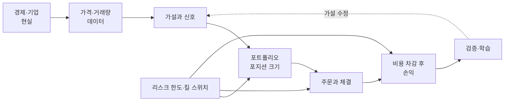

# 자동매수 시스템 개발자를 위한 투자 이론 빠른 지도

> 목적: 투자 용어를 많이 외우는 것이 아니라, **어떤 가정으로 돈을 벌고 어떤 조건에서 잃는 시스템인지** 설명할 수 있게 되는 것  
> 기준일: 2026-08-04 · 현재 시스템 점검 반영: 2026-09-24 · 예상 학습 시간: 핵심 코스 100분 / 전체 약 3시간 20분  
> 주의: 교육용 문서이며 특정 종목의 매수·매도 권유가 아니다. 세금·거래시간·호가 규칙은 변경될 수 있으므로 운영 전 KRX와 증권사 최신 문서를 다시 확인한다.

## 먼저 잡을 하나의 그림

자동매매는 단순히 `좋은 종목 → 매수`가 아니다. 다음 사슬 중 하나라도 약하면 백테스트 수익은 실계좌 수익이 되지 않는다.

핵심 질문은 네 개뿐이다.

1. **왜 벌어야 하는가?** — 가격이 움직이는 경제적·행동적 이유가 있는가?
2. **비용 후에도 버는가?** — 수수료, 세금, 스프레드, 슬리피지, 시장충격을 뺀 기대값이 양수인가?
3. **틀렸을 때 살아남는가?** — 연속 손실, 갭 하락, 체결 장애에도 파산하지 않는가?
4. **우연이 아닌가?** — 보지 않은 데이터와 실거래에서 같은 특성이 재현되는가?

## 추천 학습 순서

| 순서 | 챕터 | 얻어야 할 직관 | 전체 | 90분 코스 |
|---:|---|---|---:|---:|
| 0 | [투자·트레이딩의 mental model](00-mental-model.md) | 가격, 가치, 신호, 리스크를 분리한다 | 10분 | 8분 |
| 1 | [수익률·복리·리스크](01-return-risk-compounding.md) | 승률보다 기대값과 생존이 먼저다 | 20분 | 12분 |
| 2 | [기업·재무제표·가치평가](02-fundamentals-and-valuation.md) | 주식은 미래 현금흐름에 대한 잔여청구권이다 | 25분 | 8분 |
| 3 | [시장 미시구조·주문·체결](03-market-microstructure-and-orders.md) | 신호가 같아도 체결이 다르면 다른 전략이다 | 25분 | 12분 |
| 4 | [전략 계열과 엣지](04-strategy-families-and-edge.md) | 모멘텀과 평균회귀는 반대 가정을 산다 | 25분 | 12분 |
| 5 | [포트폴리오·상관관계·레짐](05-portfolio-and-regime.md) | 종목 수가 아니라 공통 위험을 분산한다 | 20분 | 10분 |
| 6 | [리스크 관리·포지션 사이징](06-risk-and-position-sizing.md) | 매수 종목보다 매수 크기가 생존을 좌우한다 | 25분 | 12분 |
| 7 | [백테스트·통계·과최적화](07-backtest-and-statistics.md) | 좋은 수익곡선보다 정직한 실험이 중요하다 | 35분 | 10분 |
| 8 | [실전 자동매매 승인 체크리스트](08-live-automation-checklist.md) | 이론을 코드 불변조건과 운영 절차로 바꾼다 | 20분 | 6분 |
| 9 | [현재 시스템 이론 점검](09-system-theory-audit.md) | 이론을 지금 돌고 있는 시스템에 대조한다 | 20분 | 10분 |

핵심 코스에서는 각 문서의 **한 장 요약**, 그림, `현재 시스템에 대입하면`만 읽고, 공식과 참고자료는 두 번째 회독에서 본다. 시간이 없으면 **9장부터** 읽는다 — 0~8장의 이론이 이 시스템에서 어떻게 지켜지고 어디서 어긋나는지를 숫자로 모았다.

## 2026-09-24 점검 요약

- **엔지니어링은 이론대로다** — 주문 상태기·원장, unknown 재전송 금지, 결정론적 손절, fail-closed 비대칭, 레짐 히스테리시스.
- **전략 가설은 기각됐다** — 라이브 점수와 미래 수익의 상관이 -0.014(n=320). 점수 안에 종목 간 상수 항목과 반대 가설(모멘텀) 항목이 섞여 있다.
- **병목은 점수가 아니다** — 정보가 있는 피처(전일 하락 반전, IC +0.057)도 비용 0.23%와 1종목 포트폴리오에서는 수확되지 않는다. 거래세가 왕복 비용의 87%다.
- **실현 손익비가 설계와 다르다** — 설계 1:2, 실현 1:1.27. 실현 기준 Kelly가 음수다.
- **α의 절반은 현금이었다** — 평균 투자비중 8.1%.

## 개발자용 개념 매핑

| 투자 개념 | 개발 개념으로 번역 | 대표 질문 |
|---|---|---|
| 투자 가설 | 제품 요구사항 | 어떤 현상 때문에 수익이 생겨야 하는가? |
| 신호 | 입력 기반 함수 | 미래 정보 없이 같은 입력에 같은 결정을 내리는가? |
| 엣지(edge) | 비용 후 양의 평균 효과 | 무작위 진입보다 실제로 나은가? |
| 레짐(regime) | 실행 환경/상태 | 상승장·하락장·고변동성에서 행동이 달라지는가? |
| 포지션 사이징 | 자원 할당 | 실패 한 번에 얼마를 잃도록 허용할 것인가? |
| 손절·일일 한도 | circuit breaker | 잘못된 상태가 계좌 전체로 전파되는 것을 막는가? |
| 백테스트 | 시뮬레이션 테스트 | 현실의 순서·비용·제약을 재현하는가? |
| OOS 검증 | 격리된 acceptance test | 튜닝에 쓰지 않은 데이터에서도 통과하는가? |
| 실거래 대사 | 분산 시스템 reconciliation | 주문 요청, 접수, 체결, 잔고가 일치하는가? |

## 이 저장소와 바로 연결되는 곳

- 후보 점수·모멘텀/평균회귀: [`src/services/strategy.py`](../../src/services/strategy.py)
- 즉시 손절·익절 트리거: [`src/services/watcher_triggers.py`](../../src/services/watcher_triggers.py)
- 일일 신규진입 차단: [`src/services/daily_risk.py`](../../src/services/daily_risk.py)
- 주문 intent와 대사: [`src/services/order_ledger.py`](../../src/services/order_ledger.py)
- 체결 가정을 포함한 시뮬레이터: [`backtest/engine.py`](../../backtest/engine.py)
- walk-forward와 무작위 진입 대조군: [`backtest/validate.py`](../../backtest/validate.py)
- bootstrap, PBO, DSR: [`backtest/statistics.py`](../../backtest/statistics.py)
- 피처 정보량(rank IC)·구간 안정성·비용 차감 바스켓: [`backtest/ic.py`](../../backtest/ic.py)
- 라이브 신호 전진수익률 검증: [`automation/signal_efficacy.py`](../../automation/signal_efficacy.py)
- 지수 대비 성과와 현금 대기/종목 선택 분해: [`src/services/benchmark.py`](../../src/services/benchmark.py)

## 이 문서를 다 읽은 뒤 설명할 수 있어야 하는 것

- “승률 70%”만으로 전략의 우열을 판단할 수 없는 이유
- `+50%` 다음 `-50%`가 원금 복구가 아닌 이유
- 시장가 주문이 “현재가에 체결되는 주문”이 아닌 이유
- 모멘텀과 평균회귀 신호를 같은 점수로 섞을 때 생기는 문제
- 종목 10개를 보유해도 사실상 한 종목처럼 움직일 수 있는 이유
- 손절가가 있어도 실제 손실을 고정할 수 없는 이유
- 백테스트가 좋아질수록 오히려 의심해야 하는 경우
- 주문 API timeout 후 재주문이 가장 위험한 복구일 수 있는 이유

## 핵심 원칙 7줄

1. 가격은 가치와 같지 않지만, 장기적으로 현금흐름과 할인율을 완전히 무시하지도 못한다.
2. 수익은 `방향 적중`이 아니라 `확률 × 손익 크기 − 모든 비용`에서 나온다.
3. 변동성은 기회인 동시에 복리 성장률을 깎는 비용이다.
4. 분산은 종목 개수가 아니라 **서로 다른 손실 원인**을 보유하는 것이다.
5. 손절은 예측 도구가 아니라 오류의 최대 전파 범위를 제한하는 도구다.
6. 백테스트는 수익을 증명하지 않고, 틀린 아이디어를 싸게 탈락시키는 실험이다.
7. 실거래에서는 전략보다 주문 상태, 데이터 신선도, 중복 방지, 대사가 먼저다.

